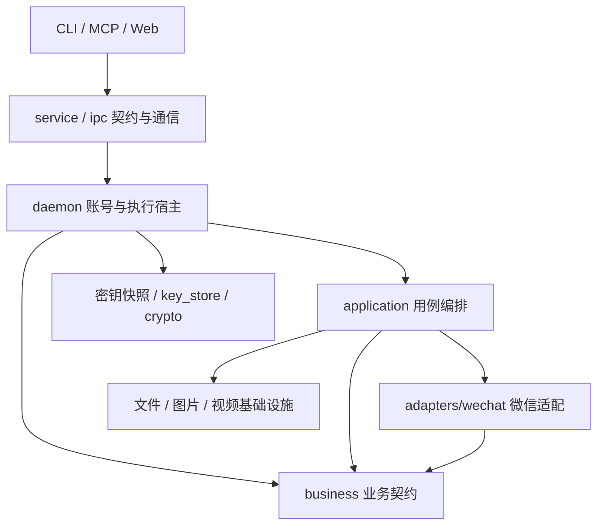
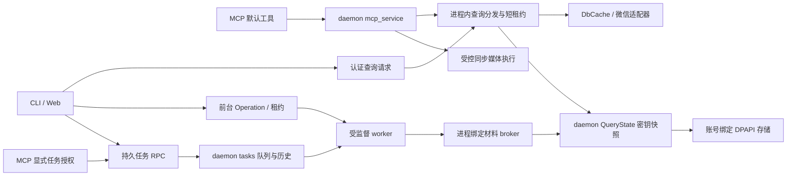

# 系统架构

wx-workbench 以账号为隔离单位。CLI、MCP 和本地 Web 负责输入、输出与协议适配；daemon 装配账号能力、管理读取快照与执行生命周期，并按需要监督 worker。业务模型和规则按业务域独立，不因经过 daemon 就归执行宿主所有，也不意味着全部工作都运行在同一个进程或持久队列中。

## 当前模块分层

下图表示职责依赖，不表示每个请求必经所有层。

| 层 | 代码位置 | 职责与界限 |
| --- | --- | --- |
| 入口 | `cli`、`mcp`、`web` | 参数、协议、输出与宿主设置；不拥有微信表结构或另一套业务执行器。 |
| 通信契约 | `service`、`ipc` | 类型化请求、认证通信及响应；不决定业务规则。 |
| 执行宿主 | `daemon` | 账号、查询租约、密钥快照、前台操作、持久任务及 worker 生命周期。 |
| 应用用例 | `application` | 导出、媒体发布、朋友圈、监控与清理的步骤编排。 |
| 业务契约 | `business` | 联系人、会话、消息、收藏、文章、朋友圈、媒体、语音和归档的对象与规则；不依赖 SQLite 表结构。 |
| 微信适配 | `adapters/wechat` | 表字段、私有消息格式、资源关联及媒体字节格式；不替宿主授予下载或写入权限。 |
| 基础能力 | `infrastructure`、`crypto`、`key_store`、`scanner`、`attachment`、`windows_process` | 文件与配置发布、图片和视频处理、数据库密码、材料存储和捕获、附件与进程支持。 |

## 运行图

查询、前台操作和持久任务是不同执行方式；MCP 默认工具不等于任务工具，后者需要宿主显式启用。worker 是独立进程，daemon 管理其权限和生命周期。

聊天目录任务的发布清单在现有任务宿主内登记为账号绑定的产物引用，入口通过专门 RPC 分页列举和有界读取，不把请求路径交给文件系统。聊天步骤结果与整个任务状态分别表达，取消或后续步骤失败仍可交付已发布产物；清单不是新队列或任意文件浏览服务。详见[任务产物交付](task-artifacts.md)。

单会话 `export_history` 使用 `service::history_export::Request`，由现有任务计划和 worker 调用固定账号的历史查询及共享四格式渲染。前台 `wx export` 复用相同渲染但保留前台生命周期与输出行为。`TaskResult` 明确区分 `chat_directory` 与 `chat_history`，按 scope 解码，目录结果 JSON 不变；单文件通过受保护发布后登记到任务产物接口，不把任意路径变成下载能力。

聊天计划任务契约由 `service::chat_plan` 拥有，`daemon::operations::plan_tasks` 装配现有 `application::chat_export_plan` 与计划选集、聊天导出能力。微信统计仍由适配层读取；任务计划不读取旧共享解密目录，而用当前账号材料创建独立快照，再以逻辑来源映射私有文件。`daemon::tasks::plan_artifacts` 管理不可变计划引用、类型化分页及逐聊天发布记录。CLI、MCP、HTTP 共用这些任务和读取 RPC，不复制选择规则。扫描授权留在入口，账号与配置复核留在共享宿主；审阅不是授权状态，发布的空选集不扩大为全量导出。

聊天媒体与计划使用的 `media_snapshot::prepare_snapshot` 在私有解密后，通过 `ResourceSnapshot` 对每库执行 SQLite Backup，并仅将副本日志模式设为 `DELETE`。静态文件移入本批次私有根下的单层路径，`DecryptedSource.source` 保留原逻辑来源，计划消费者的根内单层路径约束不变。这使普通媒体读取与严格语音关联消费同一组静态来源，不通过放宽侧车检查兼容 WAL 副本。冷解密与 Backup 都有时间成本；每库独立备份不保证跨库原子一致性。源清单及状态变化仍会拒绝处理，应等待写入稳定后重试，不删除源侧车或修改源库日志模式。这些机制说明不代表真实微信混合媒体导出已全部验证通过。

媒体恢复与编码是不同的操作：数据库使用页面加密与认证；DAT 图片含 AES/XOR 格式；远端表情可使用 AES-CBC；SNS 使用单独的密钥流机制；SILK 是音频编码，不存在单独的语音级密钥。具体材料来源与限制见[密钥存储](key-store.md)及[媒体边界](media-boundaries.md)。

## 调用路径

SNS 图片与视频的 WxIsaac64 WASM 密钥流实现位于 `adapters/wechat/media/sns_keystream.rs`。相册工作流和前台视频操作直接调用该微信格式适配器；适配器不依赖 daemon 或 CLI，不处理网络、账号授权及输出发布；这些仍由执行边界负责。固定资产、字节向量、资源预算和错误脱敏契约见 [SNS 密钥流](../src/adapters/wechat/media/SNS_KEYSTREAM.md)。

远端表情的 AES-CBC、原有宽松去填充、媒体标记与 HEVC 流定位由 `adapters/wechat/emoticons/remote_format.rs` 拥有。`application/emoticons/download.rs` 直接消费其结果，保留下载回退、转换监督与受保护发布。字节识别并非内容认证，也不改变下载/解码失败的既有阶段语义。格式规则见[远端表情格式](emoticon-format.md)。

### 执行状态与入口

daemon `QueryState` 按账号持有惰性密钥快照。查询通过租约读取；独立 worker 通过进程绑定 broker 取得授权材料，更新经过 revision 校验后原子保存。首次绑定及配置修复初始化在执行宿主中直接创建和更新正式 Store。

显式图片材料导入复用前台 Operation 与材料 broker，不另建任务或存储。宿主标准输入经 `service::image_import` 有界解析并封装为当前用户 DPAPI 密文；封装代际来自 daemon 元数据 RPC，而非 CLI 读取 Store。worker 验证固定账号、配置、样本身份和预期 revision 后提交。普通图片发布只消费受保护材料，在最终提交文件前执行宿主注入的版本复核。离线 SNS 每次固定显式数据库和缓存来源，仅对实际 V2 候选验证 AES，不建立持久来源注册表或将路径指纹解释为账号归属证明。

CLI 按业务能力提供 `wx chats`、`wx moments`、`wx emoticons`、`wx media`、`wx database` 和 `wx keys` 命令组，以及账号准备、清理、监控和本地界面入口。用例编排位于 `application`，微信格式位于 `adapters/wechat`，共享文件与编解码能力位于基础设施，Web 与 CLI/MCP 是并列入口。业务层不接管 SQL、文件系统、HTTP 或外部进程。

CLI 业务命令分别注册于 [chats.rs](../src/cli/chats.rs)、[moments.rs](../src/cli/moments.rs)、[media.rs](../src/cli/media.rs)、[keys.rs](../src/cli/keys.rs)、[database.rs](../src/cli/database.rs) 和 [emoticons.rs](../src/cli/emoticons.rs)。

服务请求直接使用 `Operation` 的业务变体：`DecodeMomentVideo`、`ExportMomentSnapshot`、`ExportEmoticons`、`Capabilities`、`DecryptDatabases`、`DecodeImageCache`、`DecodeImage`、`DecodeImageDirectory`。[执行分派](../src/daemon/operations/mod.rs)调用对应的业务模块；能力查询、数据库解密、图片解码分别位于 [capabilities.rs](../src/daemon/operations/capabilities.rs)、[decrypt_databases.rs](../src/daemon/operations/decrypt_databases.rs)、[decode_images.rs](../src/daemon/operations/decode_images.rs)。

| 入口 | 适配层 | 执行与状态 |
| --- | --- | --- |
| 普通查询 | `src/cli`、`src/service/query_client.rs` | daemon 查询分发、账号快照与缓存。 |
| 前台操作 | `src/service/operation_client.rs`、类型化 Operation | `operation_service` 持有租约、输出流及 worker Job。 |
| 持久任务 | `wx tasks`、Web 任务接口、MCP 任务工具 | `src/daemon/tasks` 管理队列、记录、取消和恢复。 |
| MCP | stdio JSON-RPC、`Call::Mcp` | `mcp_service` 持有账号锁、会话、宿主授权和媒体执行。 |
| Web 业务 | HTTP、`Call::Web` | `web_service` 持有监控及业务状态；HTTP 查询采用有界等待，不另维护持久任务队列。 |
| 命令行监控 | 前台 `Operation::Monitor`、固定账号查询传输 | 小请求直接连接账号管道；大增量状态经 `Call::Monitor` 暂存，完整校验后调用一次查询。 |

具体行为见[入口边界](daemon-entrypoints.md)、[后台任务](daemon-tasks.md)和[MCP 协议](../src/mcp/PROTOCOL.md)。

## 业务边界

入口与执行宿主消费业务契约，`adapters/wechat` 实现窄数据接口；装配使用固定账号的 `DbCache` 与查询租约。业务模块不依赖 SQLite、clap、daemon、具体微信适配器或动态 JSON。公共 Operation 与 MCP Call 由 service 契约模块拥有，CLI 在入口转换解析类型。

业务域包括[联系人](business-contacts.md)、[会话与消息](business-messages.md)、[收藏](favorites-boundary.md)、[结构化消息](structured-message-boundary.md)、[附件与媒体](media-boundaries.md)、[语音目录](voice-catalog-boundary.md)、[公众号文章](../src/business/ARTICLES.md)、[表情](../src/business/EMOTICONS.md)及[归档](archive-boundary.md)。物理来源诊断与 raw JSON 只用于显式诊断或导出，不作为普通业务身份。来源完整性与分页结束分别表达；没有额外探测时，满页只表示可能还有后续。

聊天目录的微信数字类型、名片/位置/分享 XML、系统消息与未知类型摘要由 `adapters::wechat::messages::directory_display` 解释。`application::chat_directory` 消费 `DirectoryDisplay`，负责时间、方向、媒体准备、渲染与发布。目录 JSON 中的 `local_type`、`raw_content`、`native` 是兼容字段；未知类型优先使用投影 `content`，否则截取原始正文。目录输出不改变严格媒体与兼容媒体各自的关联条件。

## 账号身份

`RuntimeContext` 由选中的配置路径、数据库目录、密钥路径及运行根计算身份。配置里的相对路径相对配置文件解析，不相对 daemon 当前工作目录。不同账号使用不同的运行目录、管道、缓存和任务记录。

启动锁、daemon PID 记录与 Windows 进程句柄协作处理并发启动。认证服务校验运行身份、实际服务 PID、创建时间及可执行文件，再发送私有令牌；不能仅凭 PID 或同名文件决定终止进程。

共享私有文件权限逻辑在 `src/private_file.rs`，不依赖业务或执行宿主。通信令牌、密钥发布、任务历史、音频暂存和图片缓存直接复用此模块。令牌、密钥及输出的 ACL、链接数和路径边界必须执行。此边界不隔离已控制当前 Windows 用户的恶意代码。

初始化即使发现正式密钥库已有材料，也必须在配置锁内完成需要的配置提交后才报告成功。配置发布失败保留原有密钥，重试可复用材料补完配置，不强制重新扫描。

已绑定账号且完整配置匹配当前运行身份时，`Memory` 初始化取得非秘密初始化 seed，`Saved` 可取得已保存账号材料以派生和验证逐库密钥；显式 `Account` 捕获要求 `force` 与重启授权。扫描或派生结果通过 `worker_keys` 提交，账号材料与逐库材料在同一 revision 更新中保存。显式 `force` 可使用 broker；provider 仅支持 `Saved`、`Memory`、`Account`，默认 `Saved` 缺材料时失败，不自动扫描。首次绑定或配置修复走 `src/daemon/operations/init.rs` 的直接 Store 分支；密钥与配置各自原子发布，不构成跨文件事务。

## 查询与数据库

查询错误投影见 [IPC 结果语义](../src/ipc/OUTCOMES.md)。

查询按需准备数据库状态。缺密钥或查询初始化失败不应阻止管理服务启动；修复后可以在同一 daemon 内重试。使快照失效前等待正在使用该快照的查询结束，避免关闭使用中的数据库。

消息查询跨分片选择与合并，分别处理最新页、最早页、日期、类型和偏移。显示名解析、群成员昵称及消息发送者身份不能只由展示层猜测。查询完整性不足时返回错误，而不是把缺失分片当成空数据。

联系人存在不代表普通消息库一定有对应的 `Msg` 表，公众号也可能没有普通聊天记录。历史查询只有在至少一个已知消息库被成功扫描、所有已知分片扫描完成且未发现未知消息库时，才允许因没有对应消息表而返回空页。缺库、无法读取的分片和 SQL 查询错误不能被当成空结果；表不存在与表结构损坏是不同情况。

冷缓存准备耗时与请求时限是不同概念。超时后仍需区分底层准备、查询错误和结果传输；不能将其他热缓存查询成功作为本次请求成功的证明。

监控的大状态只分块传输，不分块查询；全局数量限制和新会话回退语义由同一次 `NewMessages` 查询处理。`src/daemon/monitor_service.rs` 在账号内存中持有有期限、有容量限制的上传状态，不落盘。查询传输层不自动启动 daemon，命令行外层仍通过 `operation_client` 执行。限额和回收规则见[监控入口](daemon-entrypoints.md#监控与增量状态)。

## 数据库认证与缓存发布

`src/crypto` 处理 4096 字节的 SQLCipher 页面，页尾保留 16 字节 IV 与 64 字节 HMAC。`verify_page1` 验证当前源库首页；它只证明这一页，不代表整库已通过检查。`full_decrypt` 使用同一输入句柄逐页读取、按实际页号认证后解密，拒绝空库和不完整页面。低层 `decrypt_page` 只处理解密布局，不代替认证。

`apply_wal` 显式接收对应的源主库路径，从主库 salt 派生认证密钥，不从缓存路径或 WAL 代次 salt 推断。它校验 WAL 头、代次和滚动校验和，只取连续有效前缀中的最后完整提交；断裂尾部和未提交帧不应用，也不跳过坏帧寻找后续提交。选入的全部帧均按真实页号验证 HMAC，包括之后被覆盖或截断的帧。WAL 页 1 使用完整密文布局，认证页号仍为 1。提交造成的文件收缩在副本上执行，避免之后扩容重新暴露被删除页。

完整缓存刷新通过 `with_staged_output` 将主库解密与 WAL 应用组合为一次正式缓存发布；不能先替换正式缓存再验证 WAL。增量 WAL 同样先复制已有缓存。认证、写入或发布前检查失败时丢弃暂存产物，既有缓存不因这些步骤被截断；缓存索引只在缓存处理成功后更新。缓存文件和持久索引不是跨文件事务，不能据此保证断电后的同步持久性。

缓存阻塞任务持有账号工作锁，依次完成认证、数据库发布、持久索引的原子替换和内存索引更新；这些步骤不依赖请求在等待结束后继续执行。调用方取消只放弃接收结果，已经开始的任务仍持锁完成提交或返回错误。索引写入失败时不登记新的内存条目；文件与索引仍不是跨文件事务，不能只凭缓存文件存在就认定准备成功。

查询状态重初始化和失效复用同一账号工作锁，等待旧任务结束后再切换状态。daemon 停机停止接收新的查询快照，并等待在途缓存工作结束。这个提交与排空机制不承诺大型冷库能在单次请求期限内完成，也不能用暖缓存成功替代冷启动验证。

发布前同步暂存文件，并按句柄复核输出和父目录身份；拒绝检测到的重解析点、输入输出同一文件及多重硬链接输出。原本不存在的目标使用不覆盖发布。输入句柄允许微信继续写入，处理前后复核长度与修改时间，因此这不是 SQLite 事务锁，也不保证冻结在线账号的全部数据库。已有目标在最终替换前需要释放读取句柄，依赖可信目录，不能宣称对同用户恶意写者提供无竞态保证。

daemon 在复用或更新缓存前也验证当前源库首页，密钥失效或首页损坏时返回错误，不以旧缓存掩盖失败。重新捕获密钥仍需独立授权，见[账号密钥](account-key-provider.md)。

## 消息与附件

朋友圈内容解码、XML 投影及 HTML 实体表位于 `adapters/wechat/moments`。SNS 导出装配直接使用适配器。时间线、缓存恢复、归档、相册和授权后的媒体获取位于 `application::moments`；daemon 装配操作与生命周期，发布复用基础设施。

`src/daemon/query.rs` 装配会话、历史和搜索查询；微信消息结构与私有格式解析由 `src/adapters/wechat/messages` 拥有。转账、引用、位置、文件和合并记录保留结构化字段，文本渲染是展示，不负责付款或访问链接。

附件定位按当前账号和消息证据约束，拒绝不完整或歧义定位。只读资源检查不自动下载；发布图片或音频需要宿主明确输出目录。路径不得落入源、缓存、配置或密钥范围。详见[附件契约](native-attachment-contract.md)。

## MCP

`src/cli/mcp.rs` 只处理 stdio、参数封送和认证 RPC。相对宿主路径在入口转为绝对路径，防止 daemon cwd 改变其含义。配置校验、锁定、媒体发布 由 `src/daemon/mcp_service.rs` 执行。

MCP 在短查询租约外执行编排；需要数据时调用进程内查询分发，不向 daemon 自身发送管道查询。每个调用保留原始响应 ID、响应预算和绝对截止时间。超时预算不能在启动或重试时重新授予。

默认 23 项工具包含 22 项查询/元数据入口和受控 `decode_image`；未读、成员、统计、收藏、公众号、SNS 查询均通过固定白名单进入原查询分发，不重新实现业务。MCP 不公开 `debug_source`；普通 `with_meta` 不是源路径授权。任务工具由宿主另行启用，不能用任务列表替代完整业务覆盖。参数差异与结果语义见[查询协议](query-protocol.md)。

会话绑定账号、策略和拥有者进程。EOF 尽力关闭，会话拥有者退出后定期回收锁；daemon 重启后不能静默恢复旧会话。停机先取消并排空在途调用，再释放会话与运行时。

## worker 与任务

正式 `Decrypt`、`ExportEmoticons` 及确实需要数据库材料的 `ExportAll` 只获得 `READ_DATABASES`，执行流程消费 daemon 快照。执行不包含缺钥扫描或直接持久化分支；缺钥要求显式初始化。路径验证和批次行为保留。测试夹具的存储读写仅用于构造人工材料，不进入生产执行路径。

前台离线 `Operation::DecryptDatabases` 与持久任务 `Step::WechatDecrypt` 均从 daemon broker 获得只读数据库材料，通过既有私有 stdin 帧交付，不向 worker 授予密钥写权限。前台保留原离线路径校验和严格解密流程；热快照只在显式失效或重启后重新加载磁盘材料，重启遇到损坏存储明确失败。合成进程测试同时验证热快照解密和重启后不破坏既有输出。

直接表情导出 `Operation::ExportEmoticons` 也使用该只读材料通道，再交给原表情 `DbCache` 读取；预览、筛选、下载和发布继续共用既有业务实现。删除磁盘密钥文件不会隐式撤销热快照，显式重载或重启后缺钥必须失败。一键准备仍保留额外进程前置检查，但与直接入口共用 daemon 材料来源。

语音原始导出 `Operation::Voices` 同样使用 `READ_DATABASES` 和私有 worker 材料通道，不直接读取磁盘密钥库。材料在创建输出目录前取得；CLI 与 `export_voices` 任务随后统一通过 `prepare_voice_snapshot` 创建账号内的独立解密快照，不直接把共享解密缓存交给严格语音读取器。

聊天目录媒体导出同时获得 `READ_DATABASES | READ_IMAGE`：数据库材料按需从 broker 读取，图片材料随进程绑定的初始快照交付，并在每个聊天发布前后复核 revision。`application::chat_directory` 只接收窄 `MediaInput`，不依赖密钥库；dry-run、`--no-media` 和不含图片的任务步骤不获得图片读取权限。

SNS 缓存归档的前台 Operation 与持久任务 Step 同样只获得 `READ_IMAGE`，宿主将 broker 快照投影为 `CacheKeys` 后调用归档用例；归档实现不打开密钥库，也不能读取数据库或写回材料。SNS 时间线使用独立的惰性图片 broker 请求：先确认数据源存在，再按进程能力读取材料，因此继续保持“来源缺失时不读取密钥”的错误优先级。前台单图、批量图片及持久任务图片解码也消费显式投影的 `StoredImageKeys`；完整离线参数和未配置 XOR 探测仍可运行，且不会触发存储读取。

`Extract` 查询在 `dispatch_state` 的账号租约内执行，同时消费该租约的 DbCache 和图片材料；不调用默认图片 provider 或重读全局配置。DAT 读取有界并固定源文件句柄，发布复用 ExportTarget 的账号路径保护、覆盖策略和同卷暂存提交。未绑定账号租约的内部 dispatch 明确拒绝此请求。资源定位仍沿用现有附件 ID 解析，不将其宣传为所有媒体的严格业务引用；目前附件列表只支持图片。

当前前台 `DatabaseKeys` 和持久任务 `WechatKeys` 共用写入链：`operation/task worker -> service::worker_keys -> daemon::worker_keys -> QueryState::update_keys -> key_store`。daemon 向两个执行宿主注入同一个管理对象，通过原有私有 stdin 发放仅适用于当前操作或步骤的写入能力；现有服务管道同时校验固定父进程代次、实际客户端 PID、原始 worker 进程句柄与注册存活状态。任务步骤的配置路径与明确授权另行核验，普通步骤不获写入权限。材料不进入环境变量、命令参数、任务公开字段或明文临时文件。查询快照在原子保存后切换，成功路径刷新任务脱敏器，不重复丢弃已发布快照。

同一写入的重试按预期 revision 和稳定排序的材料指纹返回已完成 revision；不同写入使用旧 revision 时拒绝覆盖。RPC 等待取消不撤销已接收事务，worker 回收后撤销新请求权限。数据库取钥及图片取钥使用此写入链，包括保存模式的图片监控与授权图片任务；不保存模式不授予写权限。普通离线图片取钥不独立加载密钥库。图片监控、聊天目录媒体、SNS 和图片发布工作流通过进程绑定通道取得 daemon 快照中的图片材料，仅获得所需读取权限，不携带账号主密钥或数据库密钥；材料 Debug 脱敏、析构清零。验证前后通过内部请求复核版本，版本冲突或账号变化明确拒绝，外部文件替换仍须显式失效或重启后加载。初始化 bootstrap 仍由 daemon 直接创建正式存储，这是持久化所有权而不是应用层读取旁路。图片发布条件见[图片发布边界](image-publication-boundary.md)。

worker 在创建挂起进程时通过 `PROC_THREAD_ATTRIBUTE_JOB_LIST` 原子分配到 Job，随后恢复执行。普通操作在结束、取消和异常时回收 worker 及后代；操作输出与终态发布分开处理，回收完成前不能报取消完成。

仅明确授权的账号重启捕获使用允许用户应用脱离的专用 Job，worker 自身仍受管理。持久任务和前台操作的取消语义不同：退出持久任务等待客户端不取消任务，前台操作失联受租约约束。

任务历史、事件游标、容量与幂等以[后台任务](daemon-tasks.md)为准。已发布产物不随进程取消回滚；幂等记录也不保证永久保留。

## 原始语音交付

`wx voices` 导出原始 SILK；完整聊天导出保留语音引用，并提供原始媒体及关联 manifest 给下游工具。语音目录查询与消息关联是不同契约，媒体行号不能直接当作消息 ID。关联缺失或歧义必须明确报告，不伪造路径或文本。

`service::voice_export` 拥有无路径的原始语音任务请求与结果，`export_voices` 经既有任务 worker 调用同一选择、媒体关联和发布实现。`business::voice_export` 保持纯选择规则，微信媒体适配器负责分库与关联；入口不读取表结构。`daemon::tasks::voice_artifacts` 只在 SILK 与证据均核验完成后登记文件组，保留部分结果和取消前缀。原前台 voices 保持独立生命周期及既有目录覆盖语义，任务只用新受控目录，不把查询或所有媒体操作统一塞进队列。

参见[语音目录](voice-catalog-boundary.md)和[原始语音导出](../src/business/VOICE_EXPORT.md)。

`VoiceSnapshot` 持有各来源的 `ResourceSnapshot`。后者通过 SQLite Backup 将单库已提交数据（包括 WAL 中已提交的数据）复制到私有副本，仅在副本上设置 `journal_mode=DELETE`；不修改源库日志模式或删除源侧车。严格语音读取器仍拒绝 WAL/SHM/journal。副本生命周期覆盖导出读取；逐库备份不保证跨数据库的原子一致性，也不证明所有真实微信版本兼容。

每次原始语音导出都需要准备私有解密快照，较大的数据库可能明显增加等待时间。源库在读取期间发生变化时会明确拒绝本次处理；等待源写入稳定后再重试。不要通过删除 WAL/SHM/journal 绕过检查，也不能据此保证微信持续写入时导出必定成功。

## 导出、SNS 与 Web

`src/daemon/operations` 组织初始化、导出、增量、计划、原始语音导出和 SNS 操作。类型化调用不递归解析公共 CLI，不执行未知命令或任意业务脚本。

全量归档的准备、读取、身份核对、转换、发布和索引顺序，以及增量归档的目标去重、部分失败与批次完成由 `business::archive` 负责。宿主装配既有查询传输及原始文档发布器。全量目录索引在发布聊天文件之前绑定 `RuntimeContext.id`，拒绝其他运行上下文复用；旧无绑定记录标记 `legacy_unverified`，损坏索引不静默回退。文件已发布但索引失败时报告 `artifact_published`，不推进成功计数。

单文件使用 `infrastructure::publication::ExportTarget`，统一路径保护、目标身份、暂存、最后来源复核及提交；流式媒体写入不要求聚合整段视频。多文件使用 `infrastructure::output_tree`，按文件提交，不声称整个目录事务性或自动续跑。严格图片、表情和 SNS 下载保留各自授权、覆盖与大小限制，仅共享发布机制。

配置文档快照、独占锁、陈旧写入检测、账号路径绑定和原子 JSON 发布由 `infrastructure::configuration` 统一提供。初始化、密钥存储、查询代际和 MCP 固定账号检查复用同一实现；入口不直接读写配置。路径身份与目标保护继续委托 `infrastructure::publication`，配置模块不拥有业务执行或密钥获取算法。

清理计划、显式文件选择、账号确认、密钥删除再授权和执行报告由 `application::cleanup` 负责；Win32 文件身份、目录锁、内容指纹和按句柄删除由 `infrastructure::cleanup_files` 提供。daemon 只装配请求与结果，不能绕过计划证据直接删除路径。

`service/query_client.rs` 提供共享查询客户端，`service/transport.rs` 实现通信帧，`service/client.rs` 和 `service/protocol.rs` 承载宿主 RPC。Web 启动参数使用不带 clap 的 `service::web::HostSettings`；CLI 在入口转换，HTTP 入口位于 `src/web/mod.rs`。

CLI `query_details` 将标签、三类新增详情和只读语音目录映射到已有 `ipc::Request`，共享查询客户端负责传输和业务失败检查。HTTP 查询经 `web::read_queries` 解析固定字段，再由 `service::web::Call::validate_read` 校验；daemon 的 `web_service::read_queries` 显式映射到同一 Request，最终进入账号绑定的 `server::dispatch_state`。HTTP 没有任意 Request/Operation 入口。见[HTTP API](http-api.md)。

daemon 共享 `query_response` 按 contacts/messages 的 typed Ambiguous 识别身份歧义，保留标签及 SNS 作者解析的错误上下文，不在分类前把错误压成字符串。查询响应标记 `status=ambiguous`、`error_code=ambiguous_identity`、`exit_code=2`；CLI 保留退出码 2，MCP 经 Refused 返回 `Business request refused`，HTTP 经窄 `query_ambiguous` 投影为安全 409。HTTP 同时保留五类结构化详情的既有 exit_code=2 契约；其他业务和来源失败不依据文本猜测为歧义，继续沿用其真实类别。

SNS 领域模块分别处理数据库解析、缓存、下载、时间线、相册和目录发布。默认离线和显式下载须分开说明；MP4 文件头有效不等于可播放。Web 的鉴权、Host/Origin、CSRF 与输出目录限制仍由适配层维护。

界面关闭不等于后台业务停止。HTTP 错误、限流与超时必须在界面可识别，不应静默显示为空列表。功能条件见[工作流条件](workflow-requirements.md)。

聊天页的本地文字和类型筛选只改变当前页的可见消息，保留这一页已有的图片缓存和在途解码。恢复筛选时复用同一图片状态，不因隐藏再显示而取消并重新发起解码。账号、会话和页面切换仍有各自的失效边界；保留本页状态不表示可以跨会话复用图片，也不保证后台不会返回限流错误。

“记录范围”是另一组服务端历史条件，提交时间、多类型与最早页顺序；资料查询面板调用搜索、未读、成员、统计、收藏、文章、SNS 和语音目录接口，消息详情使用当前消息的精确身份。UI 不将本页筛选当全库搜索，也不把语音满页当作已证明 has_more。当前查询覆盖及未完成的导出、媒体、治理和增量跨入口范围见[能力矩阵](capability-matrix.md)。

## 维护

共享抽象应对应真实的共同语义，例如私有文件、发布守卫、进程监督和类型化协议。不要为减少代码行数合并账号权限、业务执行与展示层。

[测试说明](../tests/README.md)规定合成测试与真实测试的边界。[架构图](diagrams/README.md)辅助导航；图或说明与源码冲突时，先核对当前调用链，再同步文档和生成资产。
