# wx-cli 系统架构

本文随重构代码更新。当前是 Windows x64 MSVC 单平台系统，不代表全部功能已完成 Rust 迁移。
“现状”描述已经存在的调用关系；“目标”只描述待落地的边界，不把规划模块写成现有能力。

## Daemon 任务服务（2026-09-07）

当前任务所有权已从 Web 移到 `daemon/tasks`：12 类已有任务共享固定账号的有界队列、历史、取消、日志和 Windows Job 生命周期，`wx tasks` 与 Web 通过 `service/client` 调用同一类型化服务。任务认证管道与查询管道分开，但属于同一个 daemon 进程。查询状态懒初始化，缺查询密钥不阻止任务服务启动；密钥变化后的失效等待旧查询租约释放。

Web 只在启动时确保 daemon 存在；关闭 Web 不取消后台任务，用户显式停止 daemon 后 Web 也不自动重启它。任务提交先持久化，超时不自动重放，重启后未完成历史标记 `interrupted`。配置绑定、幂等保留期限、容量与安全边界见 [Daemon 任务服务](daemon-tasks.md)。最新验证见 [迁移记录](rust-migration.md)，下方旧验收数字仅适用于此前版本。

本阶段没有把全部 toolkit 直接命令、MCP 17 个工具、自动图片解码或企业离线查询统一成任务 RPC。`cli/task_worker.rs` 是过渡期类型化执行桥，直接调用已有 Rust 处理函数；它不重新解析公开 CLI 参数，也不递归提交任务。旧 Web 的 tasks/worker/process/settings/config_pin 文件已移除，领域算法与兼容入口保留。

## 此前精简验收快照（2026-09-07，历史）

本节保留 daemon 任务改造之前的精简验收时点，不覆盖上方新增服务。企业微信不继续移植扩展，保留既有代码，必要修复仅维持构建/回归；不将实机或部署的未验证事项写成已通过。

架构图最终校验：28 张 Mermaid 图全部本地渲染成功，主线回看总览与转账图；原总图的 135 条关系及标签保留。报告为 `C:/CodexLocal/architecture-qa/final/report.json`，关系保留检查为同目录 `coverage.json`。流程图节点重叠和标签越界检查为 0；不宣称所有连线交叉都已自动验证。

- **精简后全量。** 主线会话 98170 已终态退出 0；`C:/CodexLocal/wx-cli-post-cleanup-full-regression.log` 的 20 组结果合计 **1325 passed、0 failed、11 ignored**，主程序 908/0/7、共享 harness 209/0/2。覆盖本次 ASR 共享监督及 Send、HTTP→IPC 两项新增合成测试、native rich、source 等集成修改。前次 **1321/0/11** 仅为精简前功能快照，不能用于证明本次清理效果。
- **检查与前端。** `C:/CodexLocal/wx-cli-cleanup-check.log` 的 MSVC check 退出 0，9 条警告仍保留，不称无警告；主线 diff check 为 0，仅 attachments/contacts 的两条 CRLF 提示，未因此改写这两文件。个人 Web 的 `web-ui-personal-final.log` 为 **61/0**，报告 `C:/CodexLocal/wx-cli-web-qa-personal-final/report.json`；自动图片与 rich 已接线并验证相应合成场景，不再列为待实现。
- **可选测试单列。** 默认全量仍如实记 11 ignored。`C:/CodexLocal/wx-cli-native-optional-tests.log` 的 4 项及 `C:/CodexLocal/wx-cli-audio-optional-integration.log` 的 2+2 项已显式通过，覆盖本地 FFmpeg/Frida 合成用例；不改写默认 ignored，也不把重复执行算成新的独立功能。余下 2 项父进程/子进程夹具及 1 项符号链接权限测试未显式运行。
- **源码精简。** ASR 的 `local.rs`、`local_python.rs` 共用 `windows_supervision` 的 Job/输出排空逻辑，主线记录净减 50 行；SNS 4 个包装净减 16 行；主线移除失效 legacy 调用链和 3 个包装。共享 `private_file` 保留，实际私有 DACL 的 protected 位未弱化。净行数来自主线清理记录，功能验证依据是上述精简后回归，不是行数。
- **产物清理。** `C:/CodexLocal/wx-cli-prune-result.log` 的核验白名单清理共 1910 个文件、682189737 逻辑字节（约 650.59 MiB）；逻辑大小不等于实际磁盘释放量。源码、日志、模型及根目录活动构建缓存/产物保留，未以删除依赖或参考实现代替迁移验收。
- **运行与实机边界。** 直接 exe 走原生入口，不需要 Node；Node 为可选 npm 包装。旧批量转录在执行识别时按账号配置选择引擎，`transcription_backend` 缺省 `local` 使用 Python/Whisper/PyTorch，模型名缺省 `base`，可能下载权重但不上传音频；MCP 的 Python 路径另需显式 `--configured-local-python`。不声称模型推理已纯 Rust。合成测试及前端 QA 不证明真实账号历史覆盖、任意媒体可播放、真实模型/GPU 识别质量或已安装发布包/部署环境验收。

## 精简前功能里程碑（历史快照）

以下段落记录精简前时点；其中两项 HTTP→IPC 测试进行中、精简进行中等状态已由上方精简后快照更新，不再作为当前未完成清单。

用户最新明确排除企业微信：本目标仅验收个人微信和通用基础功能。企微不继续移植扩展，保留既有代码、入口及图中节点，必要修复仅维持构建/回归；企微功能是否完整不再是目标完成的前置条件。下文旧快照中涉及企微的迁移要求不再适用。

**当前功能里程碑：Rust 全量回归 1321 passed、0 failed、11 ignored，共 20 个测试套件；个人 Web 前端 61 passed、0 failures。最终精简及整个目标尚未完成。** 本次主线执行并核对日志：`cargo test --target x86_64-pc-windows-msvc` 通过，日志 `C:/CodexLocal/wx-cli-personal-full-regression.log` 的 20 条结果均为成功。跨套件存在共享模块重复执行，1321 不是独立功能数，11 项忽略不计通过。最新 MSVC check 已通过；AES 修复后的本轮完整测试亦已完成编译并运行通过，不将修复前 check 单独作为修复后的证明。

前端日志 `C:/CodexLocal/web-ui-personal-final.log` 与报告 `C:/CodexLocal/wx-cli-web-qa-personal-final/report.json` 记录桌面/手机 61 项检查通过，包括自动图片、rich 消息、通知、队列、身份隔离与失败展示；使用实际前端资产和合成 API，不代表真实账号或新增 HTTP→IPC 全链路验收。Dalton 正在补充的两项 HTTP→IPC 合成测试仍在进行，不能计入本次通过数。

此快照之后已开始最终精简：Russell 处理 ASR 重复实现，Peirce 处理 SNS 包装，主线处理失效 legacy 调用链。以上仍是进行中工作，1321/0/11 不覆盖其后修改；精简后的重新编译、回归及最终交付仍待完成。直接运行原生 exe 不要求 Node；Node 仅为可选 npm 分发包装，Python 仅在明确选择 `LegacyPythonLocal` 推理兼容路径时需要。浏览器前端 JavaScript、Frida 注入及 WASM 资产不等于 Node 生产服务。

历史证据保留：`C:/CodexLocal/wx-cli-personal-integration-test.log` 曾为 874/5/7，四项保留企微回归后来由专项 10/0 与精确 ACL 1/0 闭环，日志分别为 `wx-cli-retained-acl-ten-tests.log`、`wx-cli-retained-acl-exact.log`；Web 夹具额外 data 包装改用真实 `Response::ok` 的 serde flatten 后，`web-monitor-focused-msvc.log` 为 1/0、885 filtered out，生产行为未改变。旧失败不改写，但不再描述为当前未闭环失败；history source、自动图片与 rich 的本次集成代码以新全量快照为准。

历史目录的合成证据：上述 wx 日志中 `daemon::query::export_directory::catalog::tests` 5 项与 `cli::export_messages::tests` 4 项均通过，合计 9 项；仅证明对应合成场景，不证明真实数据覆盖，也不覆盖后加的 history source 改动。

- **个人历史聊天目录。** `cli/export_messages.rs::export_for` 使用 `ExportDirectoryCatalog`，经 `daemon/server.rs` 到 `query/export_directory.rs` 和 `query/export_directory/catalog.rs`，枚举已知消息分片的实际 `Msg_*` 表；SessionTable 不决定目录范围。联系人与 Name2Id 仅补充身份；未映射表以完整 `unknown_<hash>` 标识保留，并输出 `identity_status`、表名和来源。未映射表可按该目录身份导出，不猜测真实联系人或群身份；身份冲突及分片不完整报错。此变化限于详细目录导出，不改变基于会话表的其他列表，也不证明真实账号全历史已验收。
- **HTML 内嵌图片。** `toolkit/chat_directory/render.rs::embedded_image` 从本次媒体暂存清单读取已准备图片，以 JPEG/PNG/GIF/WebP 的 base64 data URI 写入预览和原图链接。单图上限 16 MiB，每页图片嵌入预算 64 MiB（两处 URI 均计入）；不可用、格式不支持或超限时保留目录相对引用并显示未嵌入提示。下载链接及音视频仍引用目录文件，不能称为所有媒体均自包含的单 HTML。
- **MCP 配置型本地 Python 兼容路径。** `cli/mcp.rs` 的宿主启动参数 `--configured-local-python` 默认关闭；仅显式启用后，`cli/mcp_voice.rs` 在绑定固定账号配置后读取 `transcription_backend="local"` 与 `local_whisper_model`（缺省 `base`），构造 `LegacyPythonLocal`。工具请求不能选择该后端；该模式与 whisper.cpp 程序/模型参数、云端凭证及上传授权参数互斥，不是失败后的自动回退。

MCP 的账号固定、语音关联、SILK 解码和推理宿主管理仍由 Rust 负责；`toolkit/asr/local_python.rs` 的受控子进程仍需 Python、openai-whisper、PyTorch 与模型权重，不导入旧 MCP 服务。命名模型可触发 Whisper 下载权重，此路径不上传音频，但不等于完全离线；真实模型/GPU 运行及识别质量仍须单独验收。显式 whisper.cpp 和显式授权的云后端是其他路径，不能用它们的证据代替此兼容路径验证。

自动图片和 rich 已完整接线并纳入上述功能回归与前端验证：`web/query.rs` 为消息附加完整身份/逻辑 source 描述符，`web/server.rs` 注册同源鉴权的 `/api/images/{id}/decode` POST，`automatic_image.rs` 严格定位并复用原生解码；不自动扫描密钥或下载。`web/assets/app.js` 自动排队解码、有限重试、切换会话取消及释放 Blob，并展示链接、文件、小程序、视频号、聊天记录、引用、转账和音视频等 rich 信息；异常内容安全回退。Rust 消息解析位于 `daemon/query/rich_message.rs`。latency 阶段采样已有原生路径，本轮全量成功不证明真实环境延迟测量质量。

### 共享私有文件边界

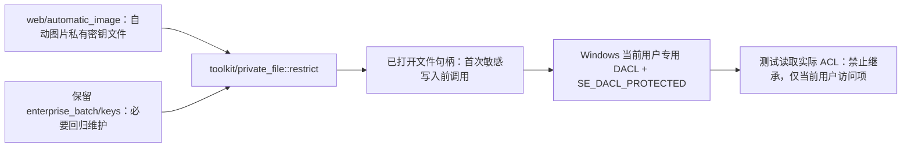
```mermaid
flowchart LR
    AUTO[web/automatic_image：自动图片私有密钥文件] --> ACL[toolkit/private_file::restrict]
    KEYS[保留 enterprise_batch/keys：必要回归维护] --> ACL
    ACL --> HANDLE[已打开文件句柄：首次敏感写入前调用]
    HANDLE --> DACL[Windows 当前用户专用 DACL + SE_DACL_PROTECTED]
    DACL --> VERIFY[测试读取实际 ACL：禁止继承，仅当前用户访问项]
```

`private_file.rs` 通过 `SetSecurityDescriptorControl` 设置实际 protected 控制位，不是跳过断言；共享权限逻辑不替代调用者的路径守卫、账号绑定和文件发布规则。此图是当前源码关系的 Markdown 图源，本轮未运行 Mermaid 渲染器；外部 SVG/PNG 不重绘。后文旧图件和测试段落均保留生成时快照，本节状态优先。

## 当前模块关系

[运行总图 SVG](diagrams/runtime-current.svg) · [MCP 语音数据流](diagrams/mcp-voice-flow.svg) · [SNS 缓存与发布](diagrams/sns-cache-publish.svg) · [ASR/WASM 接入边界](diagrams/asr-wasm-wiring.svg) · [复现步骤与源码证据](diagrams/README.md)。静态图为源码快照，不代表全功能迁移或发布验收完成。

当前图覆盖双入口、账号隔离、17 项 MCP 工具、receipt 与 checked-cache、图片元数据、导出、ASR、SNS、setup/init、本地 Web、清理和监控；保留企微节点不表示其属于本次移植验收。静态图适用范围及重生成方式见图目录，不再依赖旧图行号识别能力。

<details>
<summary>早期集成验证记录（历史，不是当前待办）</summary>

下面保留当时主线提供的检查、修复及未运行状态。其后新增测试已纳入本文顶部的精简后回归；不要据本段要求重复实现已接线能力。

证据边界：主任务提供的 `maincheck5` 已通过两个 binary 的 MSVC check，仍有 22 条警告；CLI 专项 63 passed。最新主单元测试共 801 项：794 PASS、0 FAIL、7 ignored，约 203 秒；ASR security 8 PASS、0 FAIL。新增 9 项 setup 测试尚未运行。全量测试曾因 ASR 测试缺失依赖及 chat-plan 参数问题停在 Cargo 测试编译阶段，并非已执行测试用例失败；现专项恢复，最终全量待跑。本轮仅审阅源码并验证文档图件，不运行 cargo、不读取真实账号，也不验证真实模型或已安装发布包。源码已接线不等于兼容性、模型质量或发布验收完成。

只读 legacy 审计发现的五项实际兼容缺口尚未全部验收：扫描侧包括候选长度 64..192、跨库 HMAC、多 PID、同 salt 多 DB；图片批处理包括 `skipped_no_key` 及格式对齐；离线图片包括 UIN-MD5 路径。扫描修复及 3 项测试、图片跳过修复及 4 项测试已交付，测试尚未运行。主 CLI 的 `--offline` 互斥内存模式接线已添加，但离线 helper 尚待完成，不能写成可用的完整离线能力。主任务最新提供的 UI QA 为 29 PASS、0 FAIL，使用实际前端资产与合成 API，覆盖 1440 和 390 两种视口；队列底栏重叠的 CSS 修复已完成，不代表其他功能修复或完整生产端到端验收。运行总图第 19、23 行的 UI 待复跑文字为生成时快照，以本段最新状态为准，本次不重绘。以上均为主任务提供的状态，不是本图任务独立验证的结果；不宣称 all-goal complete。

历史快照保留：前 SNS 时间线阶段为 20 targets、1142 次通过、0 失败、11 忽略，含 host 8、core 6、CLI 7，当时 check 待确认；更早相册阶段为 1121 次执行、check 10 条 unused 警告。这些包含重复模块的执行数不是唯一用例数，也不是本轮结果。

</details>

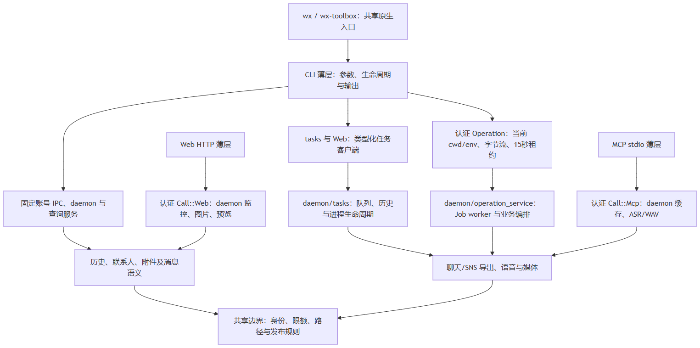

### 总览导航

以下导航图按职责定位；详细调用及安全边界保留在随后的分图。同名节点表示同一模块，跨图重复不代表重复实现。分图只调整原总览布局，不替代功能验收；保留的企微实现不属于移植验收范围。

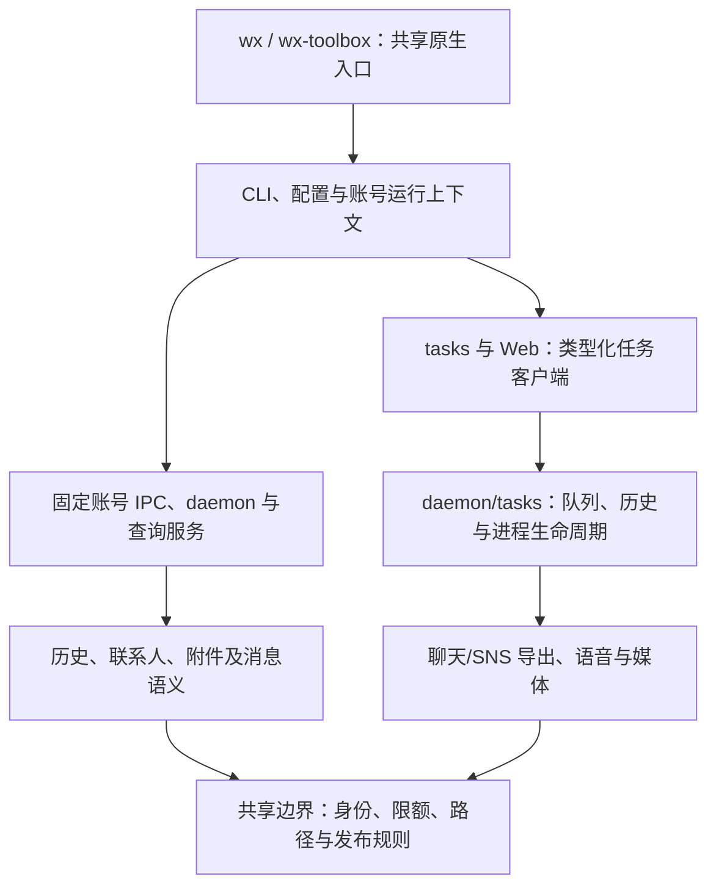
```mermaid
flowchart TB
    ENTRY["wx / wx-toolbox：共享原生入口"] --> CLI["CLI、配置与账号运行上下文"]
    CLI --> QUERY["固定账号 IPC、daemon 与查询服务"]
    CLI --> TASK["tasks 与 Web：类型化任务客户端"]
    QUERY --> DETAIL["历史、联系人、附件及消息语义"]
    TASK --> OWNER["daemon/tasks：队列、历史与进程生命周期"]
    OWNER --> MEDIA["聊天/SNS 导出、语音与媒体"]
    DETAIL --> BOUND["共享边界：身份、限额、路径与发布规则"]
    MEDIA --> BOUND
```

### 入口、配置与账号捕获

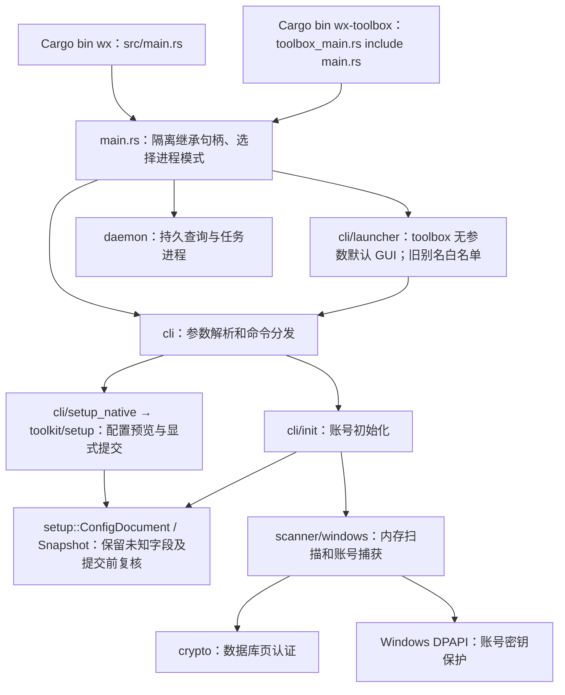
```mermaid
flowchart TB
    WX[Cargo bin wx：src/main.rs]
    MAIN[main.rs：隔离继承句柄、选择进程模式]
    TOOLBOX[Cargo bin wx-toolbox：toolbox_main.rs include main.rs]
    CLI[cli：参数解析和命令分发]
    DAEMON[daemon：持久查询与任务进程]
    LAUNCHER[cli/launcher：toolbox 无参数默认 GUI；旧别名白名单]
    SETUP[cli/setup_native → toolkit/setup：配置预览与显式提交]
    INIT[cli/init：账号初始化]
    CONFIGDOC[setup::ConfigDocument / Snapshot：保留未知字段及提交前复核]
    SCAN[scanner/windows：内存扫描和账号捕获]
    VERIFY[crypto：数据库页认证]
    DPAPI[Windows DPAPI：账号密钥保护]
    WX --> MAIN
    TOOLBOX --> MAIN
    MAIN --> CLI
    MAIN --> DAEMON
    MAIN --> LAUNCHER
    LAUNCHER --> CLI
    CLI --> SETUP
    CLI --> INIT
    INIT --> CONFIGDOC
    SETUP --> CONFIGDOC
    INIT --> SCAN
    SCAN --> VERIFY
    SCAN --> DPAPI
```

### MCP 宿主与账号传输

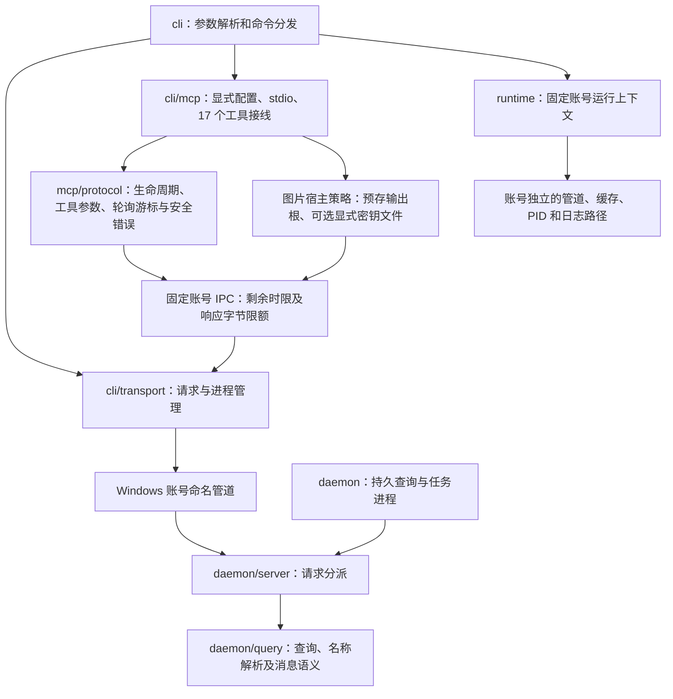
```mermaid
flowchart TB
    CLI[cli：参数解析和命令分发]
    QUERY[cli/transport：请求与进程管理]
    MCP[cli/mcp：显式配置、stdio、17 个工具接线]
    MCPROTOCOL[mcp/protocol：生命周期、工具参数、轮询游标与安全错误]
    MCPIPC[固定账号 IPC：剩余时限及响应字节限额]
    IMAGEPOLICY[图片宿主策略：预存输出根、可选显式密钥文件]
    RUNTIME[runtime：固定账号运行上下文]
    PATHS[账号独立的管道、缓存、PID 和日志路径]
    PIPE[Windows 账号命名管道]
    SERVER[daemon/server：请求分派]
    DAEMON[daemon：持久查询与任务进程]
    SERVICES[daemon/query：查询、名称解析及消息语义]
    CLI --> QUERY
    CLI --> MCP
    MCP --> MCPROTOCOL
    MCPROTOCOL --> MCPIPC
    MCP --> IMAGEPOLICY
    IMAGEPOLICY --> MCPIPC
    MCPIPC --> QUERY
    CLI --> RUNTIME
    RUNTIME --> PATHS
    QUERY --> PIPE
    PIPE --> SERVER
    DAEMON --> SERVER
    SERVER --> SERVICES
```

### 历史、联系人与引用附件

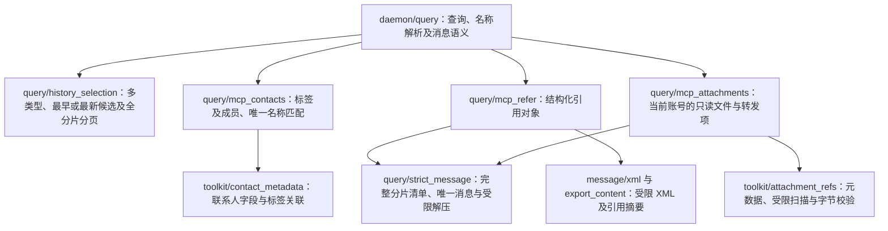
```mermaid
flowchart TB
    SERVICES[daemon/query：查询、名称解析及消息语义]
    HISTORYSEL[query/history_selection：多类型、最早或最新候选及全分片分页]
    TAGS[query/mcp_contacts：标签及成员、唯一名称匹配]
    CONTACTMETA[toolkit/contact_metadata：联系人字段与标签关联]
    REFER[query/mcp_refer：结构化引用对象]
    STRICTMSG[query/strict_message：完整分片清单、唯一消息与受限解压]
    XML[message/xml 与 export_content：受限 XML 及引用摘要]
    ATTREF[query/mcp_attachments：当前账号的只读文件与转发项]
    REFCORE[toolkit/attachment_refs：元数据、受限扫描与字节校验]
    SERVICES --> HISTORYSEL
    SERVICES --> TAGS
    TAGS --> CONTACTMETA
    SERVICES --> REFER
    REFER --> STRICTMSG
    REFER --> XML
    SERVICES --> ATTREF
    ATTREF --> STRICTMSG
    ATTREF --> REFCORE
```

### 图片定位与发布边界

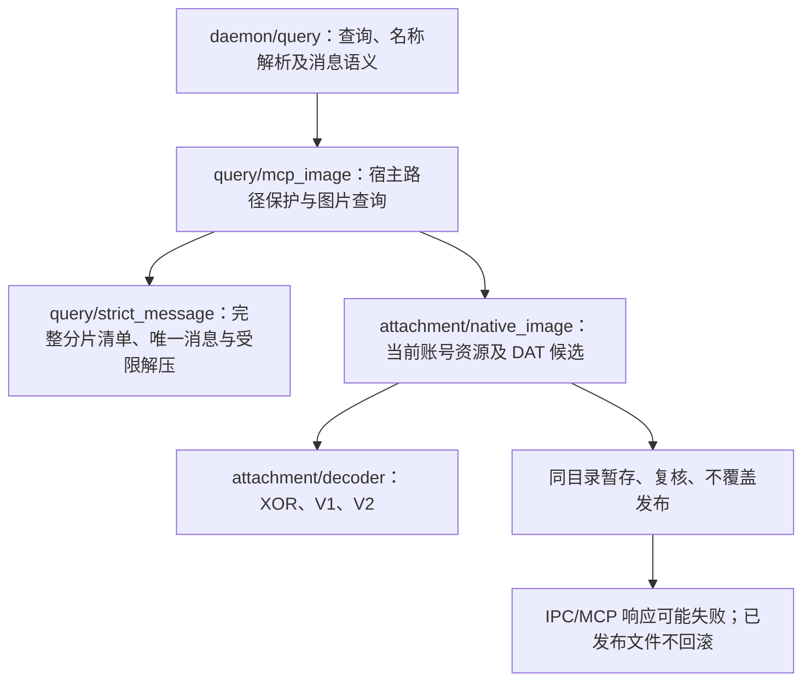
```mermaid
flowchart TB
    SERVICES[daemon/query：查询、名称解析及消息语义]
    MCPIMAGE[query/mcp_image：宿主路径保护与图片查询]
    STRICTMSG[query/strict_message：完整分片清单、唯一消息与受限解压]
    IMAGECORE[attachment/native_image：当前账号资源及 DAT 候选]
    DECODER[attachment/decoder：XOR、V1、V2]
    IMAGEPUB[同目录暂存、复核、不覆盖发布]
    IMAGERESP[IPC/MCP 响应可能失败；已发布文件不回滚]
    SERVICES --> MCPIMAGE
    MCPIMAGE --> STRICTMSG
    MCPIMAGE --> IMAGECORE
    IMAGECORE --> DECODER
    IMAGECORE --> IMAGEPUB
    IMAGEPUB --> IMAGERESP
```

### MCP 语音准备与执行

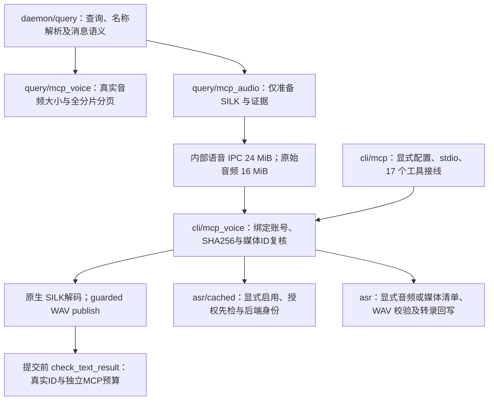
```mermaid
flowchart TB
    SERVICES[daemon/query：查询、名称解析及消息语义]
    VOICELIST[query/mcp_voice：真实音频大小与全分片分页]
    VOICEPREP[query/mcp_audio：仅准备 SILK 与证据]
    VOICEIPC[内部语音 IPC 24 MiB；原始音频 16 MiB]
    VOICEHOST[cli/mcp_voice：绑定账号、SHA256与媒体ID复核]
    MCP[cli/mcp：显式配置、stdio、17 个工具接线]
    VOICEWAV[原生 SILK解码；guarded WAV publish]
    VOICECHECK[提交前 check_text_result：真实ID与独立MCP预算]
    ASRCACHED[asr/cached：显式启用、授权先检与后端身份]
    ASR[asr：显式音频或媒体清单、WAV 校验及转录回写]
    SERVICES --> VOICELIST
    SERVICES --> VOICEPREP
    VOICEPREP --> VOICEIPC
    VOICEIPC --> VOICEHOST
    MCP --> VOICEHOST
    VOICEHOST --> VOICEWAV
    VOICEWAV --> VOICECHECK
    VOICEHOST --> ASRCACHED
    VOICEHOST --> ASR
```

### 缓存、数据库与基础媒体

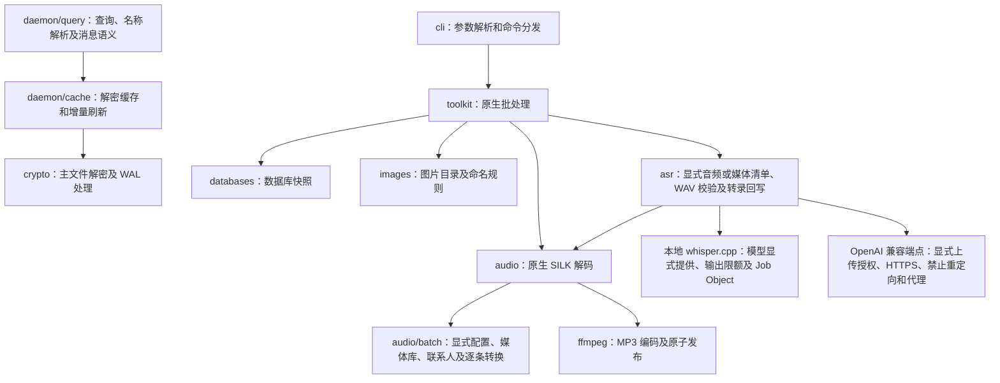
```mermaid
flowchart TB
    SERVICES[daemon/query：查询、名称解析及消息语义]
    CACHE[daemon/cache：解密缓存和增量刷新]
    CRYPTO[crypto：主文件解密及 WAL 处理]
    CLI[cli：参数解析和命令分发]
    NATIVE[toolkit：原生批处理]
    DB[databases：数据库快照]
    IMG[images：图片目录及命名规则]
    AUDIO[audio：原生 SILK 解码]
    VOICEBATCH[audio/batch：显式配置、媒体库、联系人及逐条转换]
    FFMPEG[ffmpeg：MP3 编码及原子发布]
    ASR[asr：显式音频或媒体清单、WAV 校验及转录回写]
    LOCALASR[本地 whisper.cpp：模型显式提供、输出限额及 Job Object]
    CLOUDASR[OpenAI 兼容端点：显式上传授权、HTTPS、禁止重定向和代理]
    SERVICES --> CACHE
    CACHE --> CRYPTO
    CLI --> NATIVE
    NATIVE --> DB
    NATIVE --> IMG
    NATIVE --> AUDIO
    AUDIO --> VOICEBATCH
    AUDIO --> FFMPEG
    NATIVE --> ASR
    ASR --> AUDIO
    ASR --> LOCALASR
    ASR --> CLOUDASR
```

### ASR 编排、兼容推理与缓存

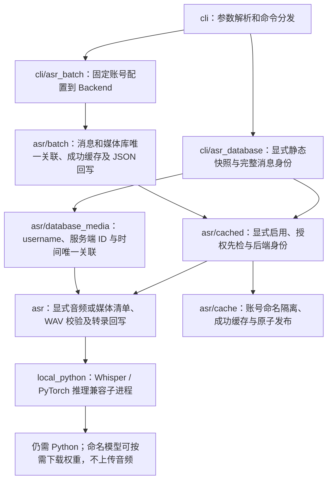
```mermaid
flowchart TB
    CLI[cli：参数解析和命令分发]
    ASRBATCH[cli/asr_batch：固定账号配置到 Backend]
    BATCHCORE[asr/batch：消息和媒体库唯一关联、成功缓存及 JSON 回写]
    ASRCACHED[asr/cached：显式启用、授权先检与后端身份]
    ASR[asr：显式音频或媒体清单、WAV 校验及转录回写]
    PYLOCAL[local_python：Whisper / PyTorch 推理兼容子进程]
    PYBOUND[仍需 Python；命名模型可按需下载权重，不上传音频]
    DBASR[cli/asr_database：显式静态快照与完整消息身份]
    VOICEJOIN[asr/database_media：username、服务端 ID 与时间唯一关联]
    ASRCACHE[asr/cache：账号命名隔离、成功缓存与原子发布]
    CLI --> ASRBATCH
    ASRBATCH --> BATCHCORE
    BATCHCORE --> ASRCACHED
    ASR --> PYLOCAL
    PYLOCAL --> PYBOUND
    CLI --> DBASR
    DBASR --> VOICEJOIN
    VOICEJOIN --> ASR
    DBASR --> ASRCACHED
    ASRCACHED --> ASR
    ASRCACHED --> ASRCACHE
```

### 视频引擎与保留企微实现

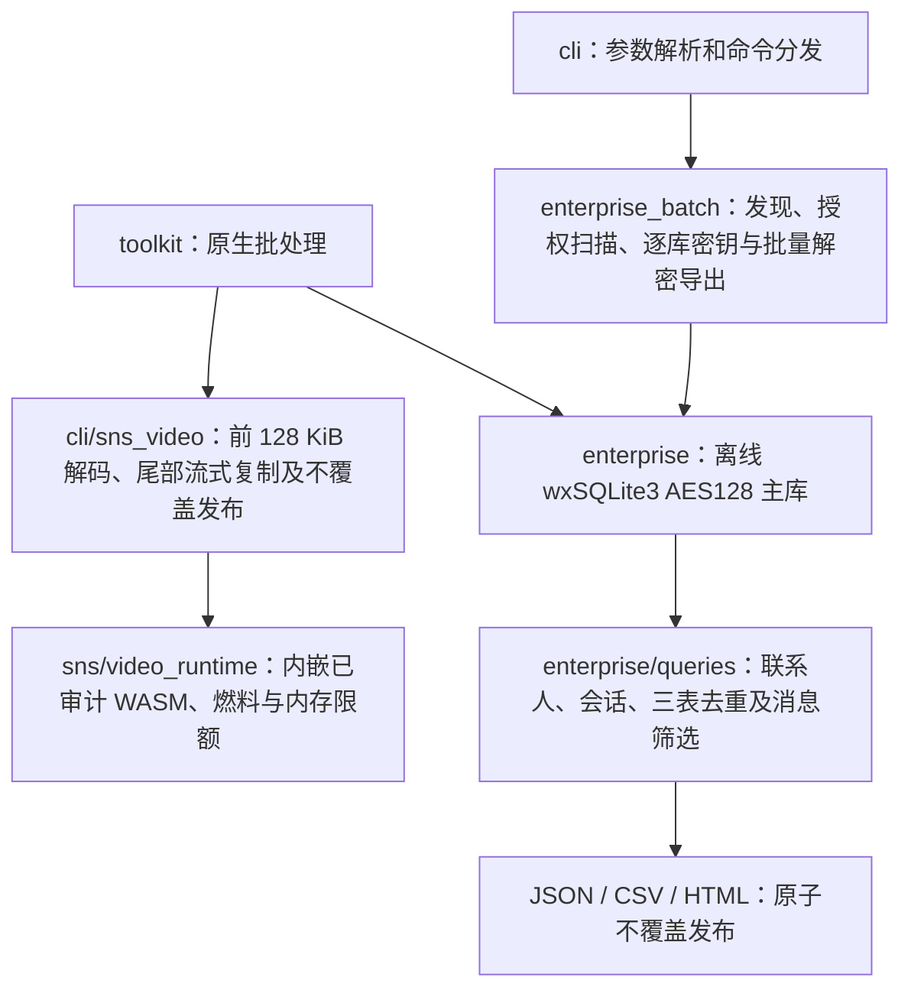
```mermaid
flowchart TB
    NATIVE[toolkit：原生批处理]
    VIDEO[cli/sns_video：前 128 KiB 解码、尾部流式复制及不覆盖发布]
    WASMI[sns/video_runtime：内嵌已审计 WASM、燃料与内存限额]
    ENTERPRISE[enterprise：离线 wxSQLite3 AES128 主库]
    CLI[cli：参数解析和命令分发]
    WORKBATCH[enterprise_batch：发现、授权扫描、逐库密钥与批量解密导出]
    WORKQUERY[enterprise/queries：联系人、会话、三表去重及消息筛选]
    WORKOUT[JSON / CSV / HTML：原子不覆盖发布]
    NATIVE --> VIDEO
    VIDEO --> WASMI
    NATIVE --> ENTERPRISE
    CLI --> WORKBATCH
    WORKBATCH --> ENTERPRISE
    ENTERPRISE --> WORKQUERY
    WORKQUERY --> WORKOUT
```

### SNS 时间线与发布

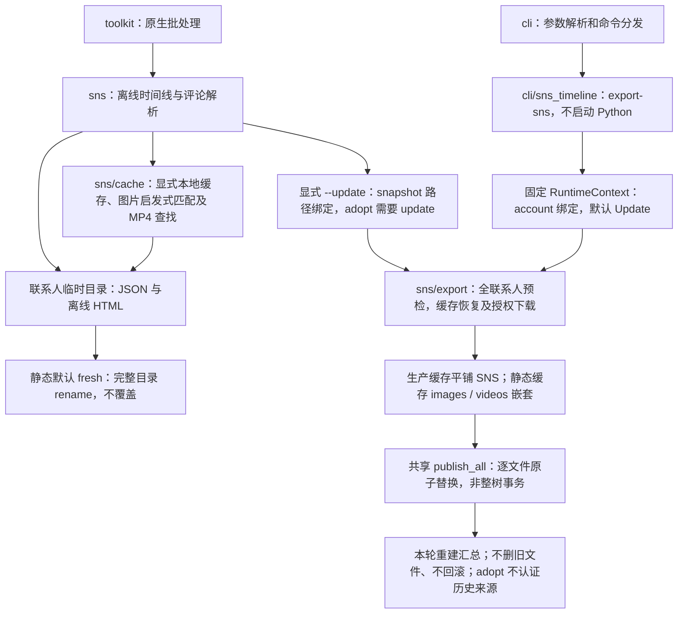
```mermaid
flowchart TB
    NATIVE[toolkit：原生批处理]
    SNS[sns：离线时间线与评论解析]
    SNSOUT[联系人临时目录：JSON 与离线 HTML]
    SNSCACHE[sns/cache：显式本地缓存、图片启发式匹配及 MP4 查找]
    SNSPUB[静态默认 fresh：完整目录 rename，不覆盖]
    CLI[cli：参数解析和命令分发]
    TIMELINE[cli/sns_timeline：export-sns，不启动 Python]
    TLACCOUNT[固定 RuntimeContext：account 绑定，默认 Update]
    TLCORE[sns/export：全联系人预检，缓存恢复及授权下载]
    TLSTATIC[显式 --update：snapshot 路径绑定，adopt 需要 update]
    TLLAYOUT[生产缓存平铺 SNS；静态缓存 images / videos 嵌套]
    TLPUBLISH[共享 publish_all：逐文件原子替换，非整树事务]
    TLLIMIT[本轮重建汇总；不删旧文件、不回滚；adopt 不认证历史来源]
    NATIVE --> SNS
    SNS --> SNSOUT
    SNS --> SNSCACHE
    SNSCACHE --> SNSOUT
    SNSOUT --> SNSPUB
    CLI --> TIMELINE
    TIMELINE --> TLACCOUNT
    TLACCOUNT --> TLCORE
    SNS --> TLSTATIC
    TLSTATIC --> TLCORE
    TLCORE --> TLLAYOUT
    TLLAYOUT --> TLPUBLISH
    TLPUBLISH --> TLLIMIT
```

### SNS 相册媒体编排

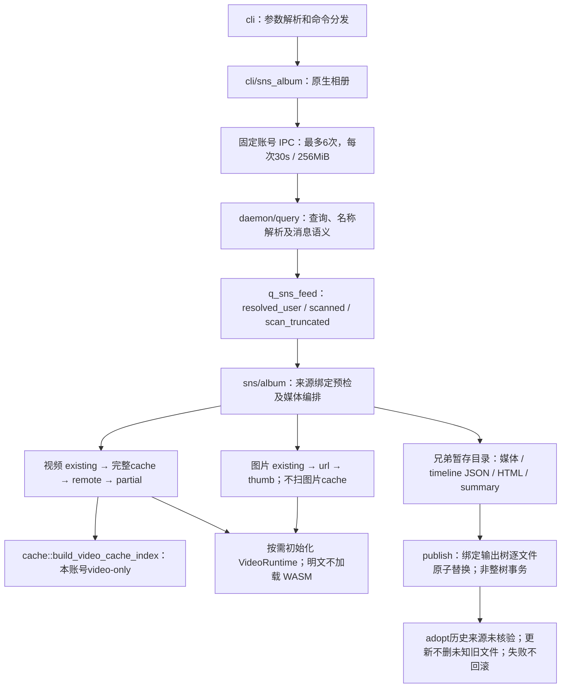
```mermaid
flowchart TB
    CLI[cli：参数解析和命令分发]
    ALBUM[cli/sns_album：原生相册]
    FEED[固定账号 IPC：最多6次，每次30s / 256MiB]
    SERVICES[daemon/query：查询、名称解析及消息语义]
    FEEDMETA[q_sns_feed：resolved_user / scanned / scan_truncated]
    ALBUMCORE[sns/album：来源绑定预检及媒体编排]
    ALBUMIMG[图片 existing → url → thumb；不扫图片cache]
    ALBUMVID[视频 existing → 完整cache → remote → partial]
    VIDEOINDEX[cache::build_video_cache_index：本账号video-only]
    LAZYWASM[按需初始化 VideoRuntime；明文不加载 WASM]
    ALBUMSTAGE[兄弟暂存目录：媒体 / timeline JSON / HTML / summary]
    ALBUMPUB[publish：绑定输出树逐文件原子替换；非整树事务]
    ALBUMBOUND[adopt历史来源未核验；更新不删未知旧文件；失败不回滚]
    CLI --> ALBUM
    ALBUM --> FEED
    FEED --> SERVICES
    SERVICES --> FEEDMETA
    FEEDMETA --> ALBUMCORE
    ALBUMCORE --> ALBUMIMG
    ALBUMCORE --> ALBUMVID
    ALBUMVID --> VIDEOINDEX
    ALBUMIMG --> LAZYWASM
    ALBUMVID --> LAZYWASM
    ALBUMCORE --> ALBUMSTAGE
    ALBUMSTAGE --> ALBUMPUB
    ALBUMPUB --> ALBUMBOUND
```

### 聊天批量导出与转录入口

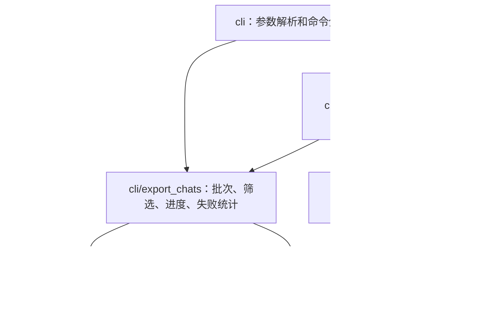
```mermaid
flowchart TB
    CLI[cli：参数解析和命令分发]
    BATCH[cli/export_chats：批次、筛选、进度、失败统计]
    EXPORTALL[cli/export_all：旧 export-chats 与 run export/all 原生编排]
    ASRBATCH[cli/asr_batch：固定账号配置到 Backend]
    INDEX[toolkit/chat_index：username 文件归属及批次锁]
    QUERY[cli/transport：请求与进程管理]
    CLI --> BATCH
    CLI --> EXPORTALL
    EXPORTALL --> BATCH
    EXPORTALL --> ASRBATCH
    BATCH --> INDEX
    BATCH --> QUERY
```

### 聊天增量与计划

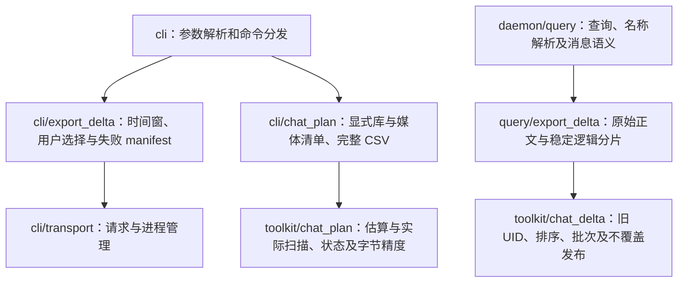
```mermaid
flowchart TB
    CLI[cli：参数解析和命令分发]
    DELTA[cli/export_delta：时间窗、用户选择与失败 manifest]
    QUERY[cli/transport：请求与进程管理]
    SERVICES[daemon/query：查询、名称解析及消息语义]
    DELTAQUERY[query/export_delta：原始正文与稳定逻辑分片]
    DELTAMODEL[toolkit/chat_delta：旧 UID、排序、批次及不覆盖发布]
    PLAN[cli/chat_plan：显式库与媒体清单、完整 CSV]
    PLANCORE[toolkit/chat_plan：估算与实际扫描、状态及字节精度]
    CLI --> DELTA
    DELTA --> QUERY
    SERVICES --> DELTAQUERY
    DELTAQUERY --> DELTAMODEL
    CLI --> PLAN
    PLAN --> PLANCORE
```

### 导出正文与基础验证

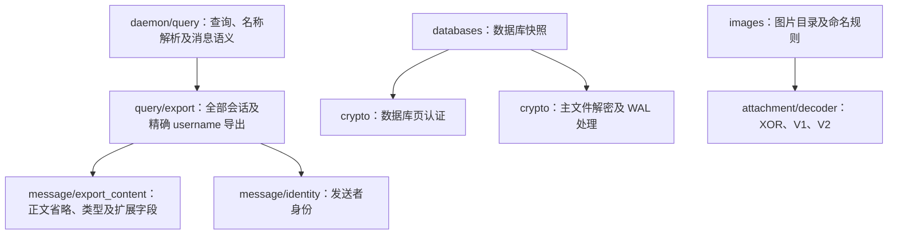
```mermaid
flowchart TB
    SERVICES[daemon/query：查询、名称解析及消息语义]
    EXPORT[query/export：全部会话及精确 username 导出]
    CONTENT[message/export_content：正文省略、类型及扩展字段]
    IDENTITY[message/identity：发送者身份]
    DB[databases：数据库快照]
    VERIFY[crypto：数据库页认证]
    CRYPTO[crypto：主文件解密及 WAL 处理]
    IMG[images：图片目录及命名规则]
    DECODER[attachment/decoder：XOR、V1、V2]
    SERVICES --> EXPORT
    EXPORT --> CONTENT
    EXPORT --> IDENTITY
    DB --> VERIFY
    DB --> CRYPTO
    IMG --> DECODER
```

### 文件发布、界面与诊断

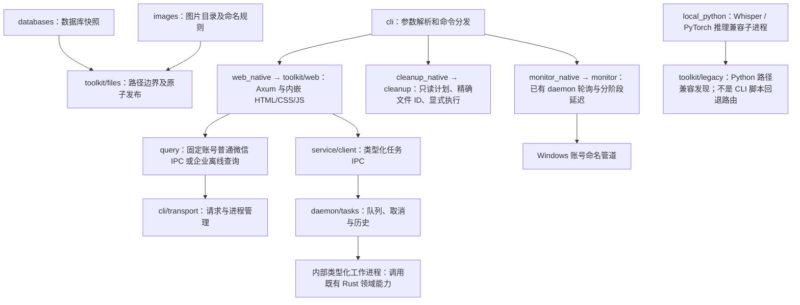
```mermaid
flowchart TB
    DB[databases：数据库快照]
    FILES[toolkit/files：路径边界及原子发布]
    IMG[images：图片目录及命名规则]
    CLI[cli：参数解析和命令分发]
    WEB[web_native → toolkit/web：Axum 与内嵌 HTML/CSS/JS]
    WEBQUERY[query：固定账号普通微信 IPC 或企业离线查询]
    QUERY[cli/transport：请求与进程管理]
    WEBTASK[service/client：类型化任务 IPC]
    TASKSERVICE[daemon/tasks：队列、取消与历史]
    WORKER[内部类型化工作进程：调用既有 Rust 领域能力]
    CLEANUP[cleanup_native → cleanup：只读计划、精确文件 ID、显式执行]
    MONITOR[monitor_native → monitor：已有 daemon 轮询与分阶段延迟]
    PIPE[Windows 账号命名管道]
    PYLOCAL[local_python：Whisper / PyTorch 推理兼容子进程]
    LEGACY[toolkit/legacy：Python 路径兼容发现；不是 CLI 脚本回退路由]
    DB --> FILES
    IMG --> FILES
    CLI --> WEB
    WEB --> WEBQUERY
    WEBQUERY --> QUERY
    WEB --> WEBTASK
    WEBTASK --> TASKSERVICE
    TASKSERVICE --> WORKER
    CLI --> CLEANUP
    CLI --> MONITOR
    MONITOR --> PIPE
    PYLOCAL --> LEGACY
```

图中的密钥与数据库读取只应针对用户授权的本地账号。账号捕获仍包含 Frida 内部执行的 Hook JavaScript，不能把“不需要安装 Node”误称为“不包含 JavaScript”。

## 双入口与初始化

`Cargo.toml` 定义两个二进制：`wx` 编译 `src/main.rs`；`wx-toolbox` 编译 `src/toolbox_main.rs`，后者仅 `include!("main.rs")`。这是两份共享源码的可执行文件，不是两套账号、任务或数据库实现。内部任务 worker 分支及 `WX_DAEMON_MODE` 分支优先于 binary 名称。

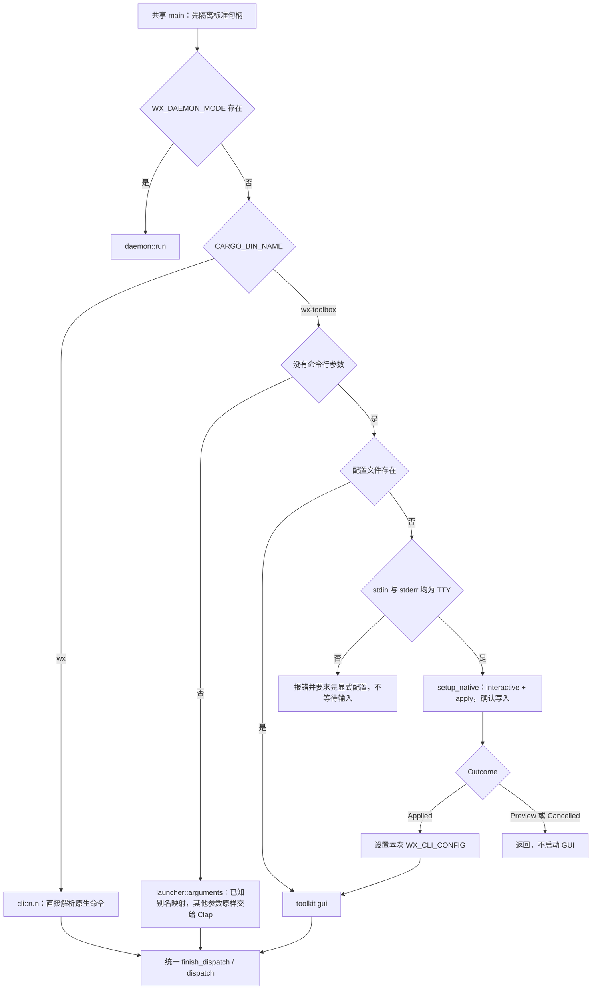
```mermaid
flowchart TD
    ENTRY[共享 main：先隔离标准句柄] --> MODE{WX_DAEMON_MODE 存在}
    MODE -->|是| DAEMON[daemon::run]
    MODE -->|否| BIN{CARGO_BIN_NAME}
    BIN -->|wx| CLI[cli::run：直接解析原生命令]
    BIN -->|wx-toolbox| RAW{没有命令行参数}
    RAW -->|否| MAP[launcher::arguments：已知别名映射，其他参数原样交给 Clap]
    RAW -->|是| CONFIG{配置文件存在}
    CONFIG -->|是| GUI[toolkit gui]
    CONFIG -->|否| TTY{stdin 与 stderr 均为 TTY}
    TTY -->|否| ERROR[报错并要求先显式配置，不等待输入]
    TTY -->|是| SETUP[setup_native：interactive + apply，确认写入]
    SETUP --> RESULT{Outcome}
    RESULT -->|Applied| PIN[设置本次 WX_CLI_CONFIG]
    RESULT -->|Preview 或 Cancelled| STOP[返回，不启动 GUI]
    PIN --> GUI
    MAP --> DISPATCH[统一 finish_dispatch / dispatch]
    CLI --> DISPATCH
    GUI --> DISPATCH
```

`setup` 只配置，不扫描进程、不加载模型。默认预览，`--check` 为能力检查；非交互写入需要 `--apply --yes`，交互取消不创建配置。只尝试用户指定目录的直属 `db_storage`，不枚举账号；保留已有未知配置字段，OpenAI 向导只保存凭据环境变量名。能力报告不是依赖或推理执行成功证明。

`init` 与向导共享 `toolkit/setup::{ConfigDocument, Snapshot}`。它先拒绝坏配置和危险目标，再选择显式目录、已有配置或缺省探测；因此不能把 setup 的“不自动发现账号”套用到 init。init 扫描验证后先原子写 keys，再提交配置；配置失败会明确报告“密钥已保存但初始化未成功”，两文件不是整体事务。已有配置的未知字段保留，扫描期间配置变化拒绝覆盖。账号级捕获需要 `--force --key-provider account --restart-wechat`；仅尝试停止身份匹配的原账号后台。

## 批量导出与 ASR

`toolkit export-chats`、`run export-all`、`run export`、`run all` 进入 `cli/export_all`；`export/all` 的非 dry-run 路径先 prepare 与解密。旧 `transcribe-chat` 进入 `cli/asr_batch`，不再运行旧整段 Python 转录脚本。已有显式音频、数据库单条、MCP 宿主入口继续保留，各入口的默认后端、身份和缓存契约不能混用。

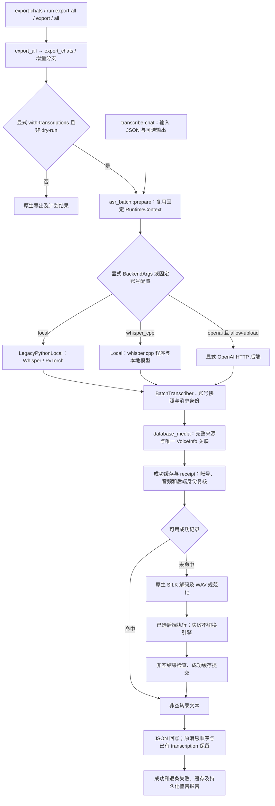
```mermaid
flowchart TD
    OLD[export-chats / run export-all / export / all] --> EXPORT[export_all → export_chats / 增量分支]
    EXPORT --> NEED{显式 with-transcriptions 且非 dry-run}
    NEED -->|否| OUT[原生导出及计划结果]
    NEED -->|是| PREP[asr_batch::prepare：复用固定 RuntimeContext]
    CHAT[transcribe-chat：输入 JSON 与可选输出] --> PREP
    PREP --> CHOOSE{显式 BackendArgs 或固定账号配置}
    CHOOSE -->|local| PY[LegacyPythonLocal：Whisper / PyTorch]
    CHOOSE -->|whisper_cpp| CPP[Local：whisper.cpp 程序与本地模型]
    CHOOSE -->|openai 且 allow-upload| CLOUD[显式 OpenAI HTTP 后端]
    PY --> BATCH[BatchTranscriber：账号快照与消息身份]
    CPP --> BATCH
    CLOUD --> BATCH
    BATCH --> JOIN[database_media：完整来源与唯一 VoiceInfo 关联]
    JOIN --> CACHE[成功缓存与 receipt：账号、音频和后端身份复核]
    CACHE --> HIT{可用成功记录}
    HIT -->|命中| TEXT[非空转录文本]
    HIT -->|未命中| AUDIO[原生 SILK 解码及 WAV 规范化]
    AUDIO --> ENGINE[已选后端执行；失败不切换引擎]
    ENGINE --> CHECK[非空结果检查、成功缓存提交]
    CHECK --> TEXT
    TEXT --> WRITE[JSON 回写；原消息顺序与已有 transcription 保留]
    WRITE --> REPORT[成功和逐条失败、缓存及持久化警告报告]
```

| 后端 | 实际实现与配置 | 当前边界 |
| --- | --- | --- |
| `local` | `asr/local_python.rs` 内嵌桥接代码；`WX_WECHAT_DECRYPT_PYTHON` 选择解释器，Whisper/PyTorch 负责推理 | 仍依赖 Python；默认工作根为选中配置父目录，可显式覆盖兼容根，不要求旧 `main.py` 存在。命名模型保留按需下载权重行为，不上传音频；不能标为纯 Rust 或严格离线 |
| `whisper_cpp` | `asr/local.rs` 监督外部程序，配置相对路径以 config 父目录解析 | 不启动 Python；模型缺省时批量兼容入口可查找已有 `ggml-*.bin` 并警告，显式原生入口仍要求程序/模型。旧 threads=0 翻译为原生自动线程策略，不是非法零线程 |
| `openai` | `asr/openai.rs`；先验证 `allow-upload`，再读凭据与音频 | 凭据支持 CLI 文件或配置环境变量；显式环境来源缺失/无效不退回旧明文 key。未配置环境来源时保留旧配置 key 兼容；不打印凭据。失败不自动回退本地或换云端 |

批量层只补没有 `transcription` 字段的语音，不排序、过滤或增加消息，不修改源数据库。它要求非空识别文本，这比底层通用成功缓存允许成功空文本更严格。成功结果可先发布，单项失败和持久化警告仍报告；独立 `transcribe-chat` 因失败或持久化警告非零退出。导出回调与独立文件回写复用同一批量转录器，不代表所有导出格式都自动嵌入了转录文本。

## 本地 Web 与 GUI

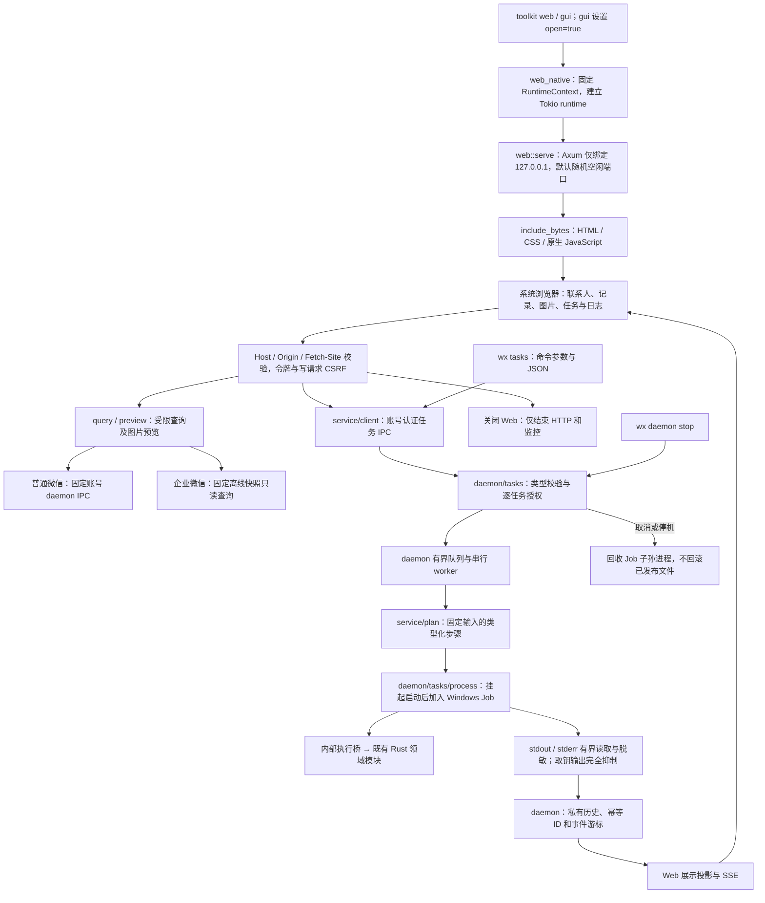
```mermaid
flowchart TD
    WEB[toolkit web / gui；gui 设置 open=true] --> HOST[web_native：固定 RuntimeContext，建立 Tokio runtime]
    HOST --> AXUM[web::serve：Axum 仅绑定 127.0.0.1，默认随机空闲端口]
    AXUM --> ASSETS[include_bytes：HTML / CSS / 原生 JavaScript]
    ASSETS --> UI[系统浏览器：联系人、记录、图片、任务与日志]
    UI --> AUTH[Host / Origin / Fetch-Site 校验，令牌与写请求 CSRF]
    AUTH --> READ[query / preview：受限查询及图片预览]
    READ --> WX[普通微信：固定账号 daemon IPC]
    READ --> WORK[企业微信：固定离线快照只读查询]
    AUTH --> RPC[service/client：账号认证任务 IPC]
    TASKCLI[wx tasks：命令参数与 JSON] --> RPC
    RPC --> SUBMIT[daemon/tasks：类型校验与逐任务授权]
    SUBMIT --> QUEUE[daemon 有界队列与串行 worker]
    QUEUE --> PLAN[service/plan：固定输入的类型化步骤]
    PLAN --> CHILD[daemon/tasks/process：挂起启动后加入 Windows Job]
    CHILD --> NATIVE[内部执行桥 → 既有 Rust 领域模块]
    CHILD --> LOG[stdout / stderr 有界读取与脱敏；取钥输出完全抑制]
    LOG --> JOURNAL[daemon：私有历史、幂等 ID 和事件游标]
    JOURNAL --> SSE[Web 展示投影与 SSE]
    SSE --> UI
    AUTH --> CLOSE[关闭 Web：仅结束 HTTP 和监控]
    STOP[wx daemon stop] --> SUBMIT
    SUBMIT -->|取消或停机| REAP[回收 Job 子孙进程，不回滚已发布文件]
```

服务端是 Rust/Axum，前端是仓库内 `src/toolkit/web/assets/{index.html,app.js,app.css}`，不是 Python Web 服务，也没有 Node 业务服务器。GUI 只是启动同一本地 Web 并打开系统默认浏览器，不是原桌面窗口的逐像素移植。HTTP handler 只转发任务协议，daemon 通过内部类型化执行桥复用 Rust 处理函数；普通只读查询与写出任务走不同路径。Web 退出不持有或终止任务 Job。

| 界面可达能力 | 当前接线 | 不能据此推导的覆盖 |
| --- | --- | --- |
| 联系人、会话、历史、标签、图片预览 | `/api/contacts`、`sessions`、`history`、`tags`、`tag-members`、`images` | 不代表所有 MCP 工具都有界面；图片预览不等于任意路径文件服务 |
| 普通微信任务 | 取数据库/图片 key、数据库解密、全量导出、图片解码、SNS、语音 MP3 | 内存扫描需单独授权；导出转录以 separate JSON 呈现，不承诺全部 CSV/HTML 自动嵌入 |
| 企业微信任务 | discover / scan / decrypt / export / run；服务启动参数固定根、Data、key 或 snapshot | 需满足各任务配置与显式会话范围；浏览器不能任意换文件路径，扫描需逐任务确认 |
| 任务控制 | daemon 有界队列、持久历史、幂等、日志、SSE、取消；CLI/Web 共享 | 关闭 Web 不等于取消任务；子进程成功不一定表示每个媒体项成功；取消不是事务回滚 |
| CLI 专用能力 | setup/init、cleanup 的完整计划执行、monitor/latency、完整 ASR 后端参数仍以 CLI 为准 | 当前任务白名单不是全 CLI 镜像；UI 的实际资产与合成 API QA 不等于完整生产端到端验收 |

## 清理与其他新链路

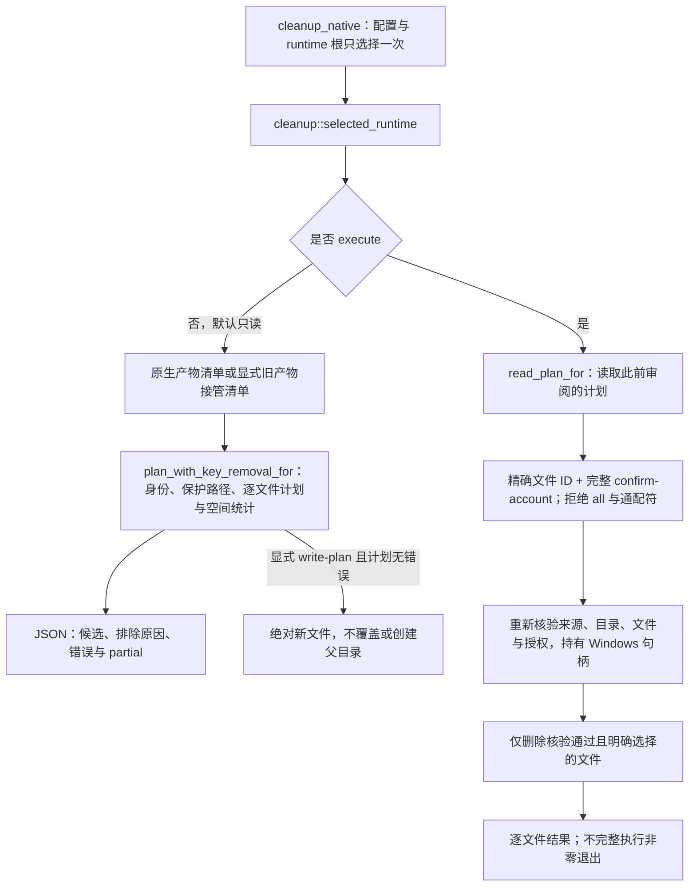
```mermaid
flowchart TD
    CLI[cleanup_native：配置与 runtime 根只选择一次] --> FIX[cleanup::selected_runtime]
    FIX --> MODE{是否 execute}
    MODE -->|否，默认只读| INPUT[原生产物清单或显式旧产物接管清单]
    INPUT --> PLAN[plan_with_key_removal_for：身份、保护路径、逐文件计划与空间统计]
    PLAN --> JSON[JSON：候选、排除原因、错误与 partial]
    PLAN -->|显式 write-plan 且计划无错误| SAVE[绝对新文件，不覆盖或创建父目录]
    MODE -->|是| READ[read_plan_for：读取此前审阅的计划]
    READ --> SELECT[精确文件 ID + 完整 confirm-account；拒绝 all 与通配符]
    SELECT --> VERIFY[重新核验来源、目录、文件与授权，持有 Windows 句柄]
    VERIFY --> DELETE[仅删除核验通过且明确选择的文件]
    DELETE --> REPORT[逐文件结果；不完整执行非零退出]
```

默认状态/计划不创建 runtime、锁或缓存；`--write-plan` 是单独显式写操作。旧文件接管需要清单、`--authorize-legacy` 和账号确认；密钥移除使用独立 `--authorize-key-removal`，规划与执行两次均须授权，不能把普通清理同意视为密钥删除同意。已知受保护输入不因接管而解除保护，也不以递归删目录代替逐文件清单。

企业微信新增 `cli/enterprise_batch → toolkit/enterprise_batch::{keys,scan,windows} → enterprise`，覆盖账号发现、授权内存扫描、账号绑定逐库 key、批量主库解密及多会话 JSON/CSV/HTML 导出。主文件快照不合并 WAL；旧 32 位结构扫描偏移不代表支持所有 64 位 cipher 结构，不能把十六进制候选扫描等同于完整版本兼容。

`cli/monitor_native → toolkit/monitor::{transport,state,cancel,terminal,latency,statistics}` 只连接已有账号 daemon，不替代其启动/停止管理。轮询初始游标与增量游标按成功响应推进，受限响应不能宣称同秒消息绝对无遗漏。latency 测量 DB/WAL 文件元数据及 Ping/Sessions/可选 History 阶段，不是网络、解密和 SQL 内部耗时分解。

## 模块职责

| 模块 | 负责 | 不应负责 |
| --- | --- | --- |
| `src/cli` | 参数、命令路由、输出格式、退出状态 | 重复实现数据库密码学和图片解码 |
| `src/cli/launcher` | 工具箱首次配置与已知旧名称到原生命令的映射 | 执行任意脚本、维护第二套业务模块 |
| `src/toolkit/setup` | 配置快照、路径保护、保留未知字段与原子提交 | 自动下载依赖、模型或执行扫描 |
| `src/toolkit/cleanup` | 只读空间统计、绑定计划及显式逐文件删除 | 默认清空缓存、跨账号递归删除或隐式移除密钥 |
| `src/toolkit/web` | Axum、本地认证、查询预览、任务 RPC 与展示投影 | 维护第二套任务队列、持有任务 Job、关闭时取消 daemon 任务 |
| `src/service` | 类型化协议、固定设置、计划、认证管道和客户端 | UI 状态、任意命令或任意路径执行 |
| `src/daemon/tasks` | 持久任务记录、有界队列、取消、日志与 Job 生命周期 | 复制底层解密/导出算法、自动重放中断任务 |
| `src/cli/task_worker` | 内部类型化步骤到现有 Rust 处理函数的过渡桥 | 解析公开 CLI 参数、递归提交后台任务 |
| `src/config` | 配置定位及当前账号路径 | UI 和大批量业务处理 |
| `src/runtime` | 账号身份、运行目录、命名管道及进程锁 | 扫描密钥、复制聊天业务 |
| `src/scanner/windows` | 内存候选提取、账号密钥捕获、逐库校验 | 聊天内容分析和媒体排版 |
| `src/crypto` | 页认证、主文件解密、WAL 处理 | CLI 参数和界面状态 |
| `src/daemon` | 持久缓存、懒初始化查询状态、任务服务、IPC | 直接调用 Python 实现基础查询 |
| `src/attachment` | 附件定位和图片解码 | 年度总结、ASR 校对 |
| `src/message` | 与存储无关的消息字段、类型语义和展示 | SQL 查询、进程、CLI 退出码 |
| `src/mcp` | MCP 协议、参数映射、受限结果及会话游标 | 自动发现账号、直接查询数据库、向 stdout 写日志 |
| `src/toolkit/chat_delta` | 原始消息 UID、增量文件与 manifest | 根据展示摘要重建 UID、改写已有完整聊天 |
| `src/toolkit/chat_plan` | 显式数据库及媒体目录统计、缺失状态与字节精度 | 自动选取私人目录、假定缺失数据库为零数据 |
| `src/toolkit/run_status` | `toolkit run status` / `-s` 的配置、文件元数据及转录只读统计 | 读取密钥内容、修改 config/key/transcript、创建缺失目录或替代 `toolkit status` 环境报告 |
| `src/toolkit/databases` | 批量主文件快照、校验及增量判断 | 宣称快照含有未合并的 WAL |
| `src/toolkit/images` | 目录布局、重复跳过、逐项失败统计 | 复制 AES/XOR 底层算法 |
| `src/toolkit/audio` | 原生 SILK SDK、ffmpeg、单文件转换及显式配置的媒体库批量转换 | 宣称 ASR 或旧一键流程全部完成 |
| `src/toolkit/asr` | 显式后端、WAV 规范化、媒体关联及回写；Python 推理兼容层单列 | 隐式上传、静默切换后端、猜测语音关联或将所有后端称为严格离线 |
| `src/toolkit/asr/batch` | 固定账号快照、唯一语音关联、成功缓存与 JSON 回写 | 覆盖已有转录、修改源数据库、失败静默换后端 |
| `src/toolkit/asr/local_python` | 受控 Whisper/PyTorch 推理兼容桥接与 Python 路径发现 | 宣称纯 Rust、把命名模型的权重下载称为严格离线 |
| `src/toolkit/enterprise_batch` | 企业账号发现、授权扫描、逐库 key 与批量解密导出 | 自动授权内存读取、宣称完整 64 位结构兼容 |
| `src/toolkit/monitor` | 已有 daemon 轮询、游标文件、取消与阶段延迟统计 | 启停后台、承诺绝对无损同秒游标 |
| `src/toolkit/sns/video_runtime` | 已审计 WASM 的离线宿主、密钥流和头部解码 | 网络下载、媒体账号选择、完整 MP4 播放验证 |
| `src/toolkit/enterprise` | 离线 wxSQLite3 解密、只读联系人/消息查询及三格式导出 | 混用普通微信算法、把无 MAC 格式称为已认证 |
| `src/toolkit/sns` | 离线数据库与评论；原生时间线更新及相册媒体编排、HTML、缓存与共享绑定发布 | 自动发现账号、将绑定当作来源认证、宣称整树事务或旧汇总 JSON 合并 |
| `src/toolkit/chat_index` | username 文件索引、同名隔离、目录批次锁 | 模糊匹配联系人、自动覆盖身份不明的文件 |
| `src/toolkit/files` | 路径防护、临时文件及原子替换 | 理解聊天记录业务 |
| `src/toolkit/legacy` | 兼容运行时发现；保留旧辅助实现 | 把旧函数存在写成当前 CLI 仍调用脚本、把缺失依赖伪装成成功 |
| `vendor/wechat-decrypt` | 历史实现、兼容材料和差异测试参考 | 默认接管已原生化的 export/run/web/gui 路由 |

## 历史阶段证据

以下 run status、表情、相册与时间线验收记录按发生阶段保留。“本轮”“最终”“最新”均指各段记录当时，不是上方六线接入后的集中回归状态；其中 ASR/exportall/GUI/cleanup 尚未迁移的描述已被上方当前接线说明取代。

### run status 只读统计

`src/toolkit/run_status.rs` 及其 `tests` 模块已实现 `toolkit run status` 与 `toolkit run -s`，`--` 后接受 `--json`、`--exported-dir`。配置相对路径以选中的 config 所在目录为基准；只统计配置旁密钥文件元数据、解密 DB 数量/bytes、普通导出 JSON 数量/bytes，以及 `messages`、`chats` 两种导出结构的转录 truthiness，不读取密钥内容。

消息库 MB 使用全部消息 DB 的实际大小之和，修正旧计算错误；坏转录文件单列 warning，不假报统计完整。原有 `toolkit status` 环境报告不变。专项日志 `C:/CodexLocal/wx-cli-run-status-tests.log` 为 2 项单元测试通过，`C:/CodexLocal/wx-cli-run-status-runtime-tests.log` 为 3 项真实命令行测试通过；真实测试清空 PATH、无 Python，验证 config/key/transcript 不变且不创建缺失目录。运行总图第 10 行展示该只读链；专项证据不代表其他 run 工作流或整体迁移完成。

### 表情原生接线与回归

`src/cli/export_emoticons.rs` 已将 `toolkit export-emoticons`（离线使用已保存 key）及 `toolkit run emoticons`（前置微信进程检查及 key 准备）接入生产，目录 catalog 与 download 使用 Rust 实现，不依赖 Python；HEVC 转换可选使用 ffmpeg。默认输出为选中配置旁的 `exported_emoticons`，旧单项失败保留批次 exit 0，不代表所有单项成功。

最终前置 prepare 安全修正已完成，`toolkit_run_prepare` 8 项单元测试全部通过。已有 keys 保持不变，不执行全库 HMAC；新扫描结果验证后原子保存，并拒绝危险路径。表情导出在账号锁下使用隔离的 `cache/emoticons` 与 `DbCache`，再进入 Rust catalog、过滤/预览或输出守卫、受限 HTTP/AES 下载与可选 ffmpeg HEVC 转换；图片不覆盖发布，转换失败保留 `.bin` 回退，`.bin` 可替换。运行总图第 11–12 行展示完整链路。

最终统一日志 `C:/CodexLocal/wx-cli-status-emoticons-final-tests.log` 中表情 runtime 6 项全部通过，更新此前专项 5 项快照；覆盖真实 loopback HTTP、加密 catalog、无关缺失 key、cache/source-preserve、help、非法 output 和逐项失败 exit 0。第 6 项以当前测试进程 name 模拟 `config.wechat_process`，走真实 `run emoticons` 成功路径、复用 saved keys，未扫描真实进程内存。MSVC check 与指定代码 `git diff --check` 退出码 0，证据 `C:/CodexLocal/wx-cli-status-emoticons-final-check.log`。额外 FFmpeg 测试 1 通过、0 失败，单列于 `C:/CodexLocal/wx-cli-emoticons-ffmpeg-test.log`，不改变常规 1001/0/10 和 2 警告基线；这些结果不代表全部旧功能迁移或已安装版本验收完成。

### SNS 原生相册（本阶段回归通过，非全部迁移）

`src/cli/sns_album.rs::cmd_sns_album` 已直接调用 `album::export`，不启动 Python/Node 或递归 CLI。`RuntimeContext` 在尝试前固定；`feed` 最多六次只读 `send_with_limits`，每次 30 秒、256 MiB，失败间隔递增至 10 秒。这不是整批 30 秒总预算，也不是六次必定执行。`q_sns_feed` 返回精确 `resolved_user`、实际扫描计数 `scanned` 和 `scan_truncated`；CLI 缺少精确作者即拒绝，扫描截断写入警告，不能把相册称为完整历史。

`src/toolkit/sns/album.rs` 编排 `album_images`、`album_videos`、`album_render`、`publish`。图片依次 `existing → url → thumb`，不做图片缓存启发式恢复，摘要 `image_cache=0`；视频依次 `existing → 完整 cache → remote → partial cache`，部分缓存只在完整来源未成功后回退，并单列不完整状态。CLI 仅在启用视频、帖子含视频且本账号 cache 存在时调用 `cache::build_video_cache_index`，不扫描 Img。`--no-remote` 禁用网络但保留 existing/视频缓存；`--no-videos` 跳过视频。工作线程按图片 1–32、视频 1–16 限制；每线程 `OnceLock` 懒初始化受限 `VideoRuntime`，明文媒体不需要 WASM。

`publish::prepare` 先固定输出祖先、保护输入、预检候选及协作锁，并建立 `_source_binding.json`，然后在输出树外的兄弟 `.wx-album-*` 暂存媒体与文档。默认新目录；`--output-dir` 可更新同绑定目录；无绑定非空旧目录需要显式 `--adopt-existing`，已知账号或联系人冲突仍拒绝。认领保留 `legacy_unverified=true`：旧文件及复用媒体的历史账号来源未核验，绑定文件也不是导出完成标记。

`publish_all` 按媒体、`timeline.json`（数组）、`timeline.html`、`export_summary.json` 顺序，在目标同目录暂存后逐文件原子替换。没有整树事务、跨文件 CAS 或失败回滚；部分提交后可失败。更新只处理计划中的文件，不删除未知旧文件或旧子树，不代表旧时间线合并 upsert。媒体缺失计入摘要，输出/身份保护失败停止发布。

当前源码已有旧 JSON `take(limit+1)` 受限读取（timeline 256 MiB、summary 1 MiB）、绑定清单 64 KiB 受限读取和网络图片受限读取；不是仅检查读取前文件长度。`video_bytes` 已覆盖 existing 与 remote。`publish.rs` 从持有的源句柄取得 mtime，在二次复制后通过 `FileTimes` 恢复，再 sync/persist，保留缓存视频时间契约。长英文 h1 仅新增 `overflow-wrap:anywhere` 规则，golden 显式接受这一处差异。浏览器测试 fixture 的视频为空占位文件，唯一预期资源错误已单列，不代表播放器验收通过。

最终日志 `C:/CodexLocal/wx-cli-album-complete-final-tests.log` 共 19 个 targets、1121 次通过、0 失败、11 忽略，主任务确认 exit 0；其中相册 CLI 12/0，第 1292 行完整/部分缓存最终 mtime、第 1298 行加密视频前缀解码及尾部保持均通过。最新 MSVC check 日志 `C:/CodexLocal/wx-cli-album-complete-final-check.log` 由主任务确认 exit 0，10 条 unused 警告；相关 rustfmt check 由主任务确认通过。本图任务只读取证据，未运行 cargo。1121 包含重复模块执行，不是唯一功能数；全目标迁移仍未完成。

#### 原生时间线入口（测试通过，check 待确认）

`toolkit export-sns` 已经通过 `src/cli/sns_timeline.rs` 调用 `export_database_with_publication`，不再启动 `export_sns.py`。生产宿主固定选中配置的 `RuntimeContext`，读取该配置的解密 SNS/联系人库；默认输出配置旁 `wechat_files/<选中账号>`。只使用选中账号 cache 及配置明确声明的旧缓存路径，不模糊发现其他账号。默认 `ExistingPolicy::Update`、`source_kind=account`，来源 ID 为 runtime ID。缺失 SNS 库按旧约定警告后成功退出，不创建输出；空结果或空筛选不改旧输出。

缓存恢复优先；生产入口的 `--download-media` 或 `WECHAT_SNS_DOWNLOAD_MEDIA=1` 授权下载，`--no-remote` 优先禁止网络。生产缓存恢复文件平铺在联系人 `SNS/` 下。独立 `export-sns-native` 仍使用显式静态数据库与缓存，只有 `--download-media` 才联网，缓存文件保持 `images/`、`videos/` 嵌套；默认 fresh 拒绝已有 SNS 目录并整目录 rename。显式 `--update` 才使用共享发布器，`--adopt-existing` 必须同时带 `--update`；静态绑定是规范化数据库路径派生的 `snapshot` 身份，不是账号认证。

共享 `src/toolkit/sns/export.rs` 在任何媒体下载或内容发布前预检全部联系人、候选路径和绑定，并持有协作锁；`tree_kind=timeline` 与相册独立。未绑定非空旧目录须显式 adopt，已知来源/作者冲突仍拒绝；`legacy_unverified` 不认证历史媒体。暂存后经 `publish_all` 按媒体、单帖、timeline JSON、HTML、恢复报告逐文件原子替换；没有整树事务或失败回滚。汇总由本轮数据库重建，不合并旧 timeline JSON；未计划旧文件保留。不能把它与相册 Feed、图片 existing/url/thumb 或 video-only 缓存策略混为一谈。

专项日志 `C:/CodexLocal/wx-cli-sns-timeline-runtime-retest.log` 为 CLI 7 项通过、0 失败、0 忽略，包含全批联系人晚冲突预检测试。主任务随后确认 `C:/CodexLocal/wx-cli-sns-timeline-all-retest.log` exit 0：20 targets、1142 次通过、0 失败、11 忽略，含 host 8、core 6、CLI 7；这是含重复模块的测试执行数。check 仍待主任务确认。本次文档工作不运行 cargo、不读取真实账号。ASR、exportall、GUI 及后续清理仍有剩余工作，不宣称整体迁移完成。

#### 历史图源复现

在仓库根目录执行以下命令（Python/Node 仅用于文档绘制）：

```powershell
python docs\diagrams\render_architecture.py --diagram runtime-current --defer-evidence
python docs\diagrams\render_architecture.py --diagram sns-cache-publish --defer-evidence
node docs\diagrams\export_png.cjs C:\Users\leyan\.cache\codex-runtimes\codex-primary-runtime\dependencies\node\node_modules\playwright runtime-current
node docs\diagrams\export_png.cjs C:\Users\leyan\.cache\codex-runtimes\codex-primary-runtime\dependencies\node\node_modules\playwright sns-cache-publish
```

`docs/diagrams/source-evidence.json` 保存前次源码 SHA-256、人工核对的字符串锚点与当时行号；本轮明确不修改该文件。并行源码尚在更新，使用 `--defer-evidence` 只绘图与校验，图上标示证据待封存；本轮不能声称 `--check-source` 已通过。锚点不是编译证明，最终封存由主任务协调。`render-report.json` 为浏览器实测排版结果；完整命令输出保存在 `C:/CodexLocal/wx-cli-sns-timeline-diagrams.log`。README 与下文前阶段回归计数均不是本轮全量结果。

## 数据库快照时序

```mermaid
sequenceDiagram
    actor U as 用户
    participant C as toolkit decrypt
    participant CFG as 当前账号配置
    participant SRC as 源数据库（只读）
    participant V as crypto
    participant TMP as 同目录临时输出
    participant OUT as 已发布快照
    U->>C: incremental / dry-run
    C->>CFG: 读取数据库路径、输出路径、已保存密钥
    C->>C: 排除 migrate、检查输出不在源目录内
    loop 每个数据库
        C->>C: 解析对应密钥、检查增量时间
        alt 已有结果且未更新
            C->>C: skipped + 1
        else dry-run
            C->>C: planned + 1，不创建输出
        else 需要导出
            C->>SRC: 读取第一页
            C->>V: 校验第一页 HMAC
            C->>OUT: 检查是否存在活动 WAL/SHM
            C->>V: 解密主文件到临时文件
            V->>TMP: 写入明文页
            C->>TMP: SQLite quick_check
            alt 解密及完整性检查通过
                C->>OUT: 同卷原子替换
            else 任一步失败
                C->>TMP: 清理本次临时文件
                C->>C: 记录失败，保留已有输出
            end
        end
    end
    C-->>U: JSON 统计，有失败则非零退出
```

此命令保留旧脚本的主文件快照语义。需要包含实时 WAL 的聊天查询，仍通过后台缓存路径完成。
增量模式按旧约定比较文件时间，并不重新认证已经跳过的输出；不能将它视为完整性审计命令。

## 图片输出规则

### MCP 图片发布

`decode_image` 与旧 `extract`、工具箱目录批处理是不同入口，不继承它们的自动密钥发现、输出路径或覆盖选项。14 项只读工具保持原边界；另有 `decode_voice`、`transcribe_voice` 两项宿主执行工具，流程见下节。

```mermaid
sequenceDiagram
    actor H as 宿主
    participant P as MCP 协议与 CLI 策略
    participant S as 固定账号 daemon
    participant Q as mcp_image / strict_message
    participant N as native_image / decoder
    participant O as 预存本地输出目录
    H->>P: 启动时设置 media-output-root / 可选 image-key-file
    H->>P: decode_image(chat_name, local_id, create_time=0)
    P->>P: 拒绝工具路径、密钥、覆盖和上传参数
    P->>P: 预存目录校验；固定账号前注入宿主路径
    P->>S: DecodeImage + 剩余时限 / 响应限额
    S->>Q: q_decode_image_with_key_file
    Q->>Q: 保护目录和输入；有界读取显式密钥；唯一消息和完整清单
    Q->>N: 当前账号资源库、附件根及消息身份
    N->>N: 资源关联 / DAT 候选 / XOR、V1、V2 解码
    N->>O: 暂存、sync_all、发布前复核
    N->>O: persist_noclobber：不覆盖已有目标
    N-->>Q: 本地发布结果与关联证据
    Q-->>S: exit_code=0 / status=published / image
    alt 响应限额与期限允许且发送成功
        S-->>P: 图片结果
        P-->>H: JSON-text 本地引用
    else 发布后超限、超时或传输失败
        S--xP: 响应可能无法交付
        Note over H,O: 调用失败不回滚文件；先核对输出，不承诺自动重试或幂等成功
    end
```

输出目录必须预先存在，与受保护的源、缓存、配置及密钥路径隔离；宿主 CLI 可将相对路径转绝对路径，拒绝 `..`，daemon 再执行路径保护。密钥文件最多 4096 字节，仅由宿主给出，不自动扫描密钥；V2 缺有效 AES 密钥明确失败。不下载、不上传、不启动外部图片转换器。

文件名为明文摘要加检测格式；同名目标存在即拒绝，不自动复用为成功结果。资源扫描与文件名仅为启发式关联证据。`readOnlyHint=false` 反映本地写出，`destructiveHint=false` 表示不覆盖；不能推导出恰好一次语义。外层取消或超时不保证停止 daemon 阻塞任务，轮询游标回滚也不回滚图片。

图片目录替换独立回归已由 main 确认 20 passed、2 ignored；不把守卫升级为同权限恶意进程沙箱，也不改变发布后响应非事务边界。列表已接 image_metadata 查询与 md5/size/resource_status/size_status 投影，size_kind 为 encrypted_dat_metadata，binding 为 exact_resource_standard_filename_metadata；不代表明文大小或摘要，缺失/歧义保持 null 与状态。专用 q_attachments_with_image_metadata 在全局分页后对页内身份执行全分片 COUNT 唯一性核验；共享 ResourceReader 精确行事务与每页一次 scan_candidates / Scan / Pin 扫描输出资源 MD5 和加密 DAT metadata.len，不读 DAT 正文、不解码或上传；普通 CLI 附件查询保持轻量。最新全量日志包含图片真实进程 2 项通过；生产图片夹具 75 项与冷查询/缓存刷新回归由 main 回报通过。

### MCP 语音准备与宿主执行

```mermaid
sequenceDiagram
    actor C as MCP 调用方
    participant H as cli/mcp + mcp_voice
    participant D as 固定账号 daemon
    participant B as 显式 ASR 后端与成功缓存
    participant W as WAV guarded publisher
    C->>H: decode_voice / transcribe_voice(chat_name, media local_id)
    H->>H: prepare：宿主路径与授权；默认本地私有 TempDir
    H->>H: bind RuntimeContext；保护账号和输入
    opt 转录且启用持久缓存
        H->>B: try_cached：精确 username/media_id/账号/后端 receipt
        B-->>H: 只读命中或 Miss/Conflict/Unavailable
        Note over H,B: 命中经预算和账号复核直接返回；不走下方语音 IPC，不改缓存
        Note over H,D: 显示名可能先 ResolveChat；以下源准备仅用于未命中
    end
    H->>D: DecodeVoice / TranscribeVoice；同一剩余期限
    D->>D: mcp_audio::q_prepare_voice；唯一映射与有界 SILK
    D-->>H: prepared_audio + 证据；内部 IPC 24 MiB
    H->>H: 限额 / SHA256 / 媒体ID / 绑定账号复核
    alt decode_voice
        H->>W: 实际 SILK 解码生成 WAV；暂存并 sync
        W->>H: before_commit：真实ID包装的 check_text_result
        H-->>W: 独立 MCP 帧预算、deadline、账号检查通过
        W->>W: 复核守卫与暂存字节；persist_noclobber
        W-->>H: 提交前构造的成功文本
    else transcribe_voice
        H->>B: 显式 Backend；timeout 只收紧至当前 remaining
        B->>B: 可选绑定账号缓存；timeout 不参与 identity
        B->>H: 识别结果 preflight：exact文本预算、原始守卫、context、账号
        H-->>B: 允许本次缓存暂存
        B->>B: store_success_checked：暂存、sync、快照复核
        B->>H: actual persist 前再次回调
        H-->>B: 复核通过才允许提交；拒绝不发布本次缓存
        B-->>H: 文本、语言与缓存状态
        H->>H: check_text_result + deadline + 账号复核
    end
    H-->>C: 纯文本成功模板；不公开 prepared_audio
    Note over C,W: 预算预检不保证通道送达；断开不能回滚已发布文件或缓存
```

daemon 不调用识别后端、不读取凭证、不发布 WAV。host 默认本地 whisper.cpp，程序与模型显式提供；没有自动模型下载或云回退。云端必须由宿主选择 explicit-open-ai 并明确 allow-upload，工具参数不能授权。未指定 temp-root 时仅 prepare 创建请求私有 TempDir，Pending 持有到处理结束；初始化与 tools/list 不创建目录或读取模型、凭证。显式路径支持相对转绝对，先拒绝原始 `..`。

内部原始语音上限 16 MiB，语音 IPC 单独 24 MiB，公开 MCP 帧仍使用独立的 max-frame-bytes。`check_text_result` 使用真实请求 ID 和实际 JSON 包装；不是音频大小或固定模板长度估计。后台非零或畸形 exit_code、data.error 先映射 QueryFailed，再考虑 payload 完整性。

宿主缓存使用绑定账号身份，键保留消息来源、时间、音频摘要、模型和识别配置；timeout 不参与身份。receipt 索引允许精确 username + media_id 按后端配置和记录摘要只读命中，无需现存源语音或运行中的 daemon；显示名可能仍需 ResolveChat。receipt 只证明历史成功记录，不认证源消息当前存在。无源弱缓存不能补造身份；有源强身份成功缓存可在真实 identity/evidence 核验后补写 receipt，不必重新识别。未命中走源准备及 `transcribe_cached_with_receipt_checked`，提交前保留 exact 文本预算、原守卫、context 与账号检查，拒绝不发布。普通缓存 I/O 失败仍不丢弃成功识别，提交后通道中断仍不回滚。

### 工具箱既有批处理

```mermaid
flowchart LR
    INPUT[输入 .dat] --> DISPATCH{文件头}
    DISPATCH -->|旧格式| XOR[自动推断单字节 XOR]
    DISPATCH -->|V1| FIXED[固定 AES 密钥]
    DISPATCH -->|V2| KEY[配置或命令行 AES/XOR 密钥]
    FIXED --> DECODE[AES + 原始中段 + XOR 尾段]
    KEY --> DECODE
    DECODE --> CHECK[格式检测及 JPEG/PNG 尾部检查]
    XOR --> CHECK
    CHECK --> TMP[同目录临时文件]
    TMP --> SYNC[落盘及原子发布]
    SYNC --> OUT[明文图片]
```

- 单文件解图：未指定输出时使用原文件目录，去掉 `_t/_h` 后缀；不允许覆盖输入文件自身。
- `decode-images`：只处理 `<聊天>/<月份>/Img/*.dat`，输出为 `<聊天>/<月份>/<基础名>.<格式>`。
- `batch-decrypt-images`：递归保留子目录，去掉 `_t/_h` 后缀，跳过已有基础名输出。
- `decode-images --force`：重新解码，但失败不能替换旧图片。
- 不跟随源目录内部的目录联接或重解析点，避免跨账号扫描及循环。
- V2 缺少密钥时明确记录失败，不输出空图片；`wxgf` 容器保留为 `.hevc`，不冒充可播放 MP4。

## 原始目标架构（历史设计）

下图保留最初的职责划分意图，节点不与当前文件一一对应，图中“过渡阶段”是原设计标注。当前文件及调用以“当前模块关系”和后续专项图为准；保留成熟引擎不视为待移植缺口。

```mermaid
flowchart TB
    ENTRY[CLI / 本地界面 / 自动化调用] --> APP[应用服务：用例编排和任务状态]
    APP --> ACCOUNT[账号上下文：配置、密钥引用、运行目录、IPC 标识]
    APP --> CHAT[聊天服务：查询、分页、导出及证据]
    APP --> SNS[朋友圈服务：文本、图片、视频和相册]
    APP --> VOICE[语音服务：SILK、转换、识别及校对]
    CHAT --> DOMAIN[共享领域类型：账号、联系人、消息、媒体、任务结果]
    SNS --> DOMAIN
    VOICE --> DOMAIN
    DOMAIN --> INFRA[基础设施：SQLite、文件、密码学、HTTP、受控子进程]
    INFRA --> WIN[Windows 适配：内存、DPAPI、进程、命名管道]
    VOICE -. 过渡阶段 .-> BACKENDS[ASR 模型 / 外部编解码器]
    SNS -. 过渡阶段 .-> WASM[视频 WASM 运行时]
```

不为画图而预先创建空模块。每次拆分必须减少真实耦合，并有对应的契约测试。
FFmpeg、ASR 模型及 WASM 等成熟引擎可以保留，通过 Rust 适配；是否去掉某个运行时以功能和性能验证结果为准。
npm 安装入口是发布渠道，不等于 Node 业务服务，不能直接删除导致现有用户无法安装。

## 持续维护边界

1. 账号级运行目录与命名管道已落地，并增加真实进程隔离测试。旧固定管道和旧缓存不会自动接管或删除；发布切换仍需说明旧后台的退出方式。
2. 配置和密钥读取存在不同信任边界，不能为了共用函数而放宽 MCP 宿主配置、离线显式文件或账号级配置的契约。共享私有文件权限已集中于 `toolkit/private_file.rs`。
3. 后台已拆出严格消息定位、历史选行、图片/语音/附件适配及 rich 解析模块。后续修改继续复用这些边界，并保持 JSON 输出与错误可见性。
4. 外部直接运行保留的旧脚本仍可能使用自己的配置上下文；当前原生 CLI 不自动回退这些脚本。本地 Python ASR 的兼容工作根也须与固定账号配置区分。
5. 朋友圈已有下载回退、缓存恢复、并发、视频解码和 HTML 发布。远端可用性、缓存完整性及任意视频播放仍需真实数据验证，不能从合成 MP4 文件头检查推断全部可播放。

## 验收矩阵

| 层级 | 核验内容 | 当前证据 |
| --- | --- | --- |
| 单元测试 | 路径边界、原子写入、失败保留、密钥格式、CLI 参数 | Rust 测试 |
| 差异测试 | XOR/V1/V2 字节、新旧批处理目录、缩略图去重、重复跳过 | `tests/migration_parity.py` |
| 数据库差异 | 隔离副本逐字节比较、dry-run、增量、错误密钥保留旧文件 | 可选 `--account-config` 测试；不提交私有数据 |
| 平台构建 | Windows x64 MSVC | `cargo check --target x86_64-pc-windows-msvc` |
| 全量回归 | 当前 Rust 单元、集成、进程与差异测试 | 当前结果见本文顶部；独立旧 Python 历史结果不混入本轮统计 |
| 发布 | 命令帮助、打包资产、旧版本回退 | 完成发布验证后才能覆盖已安装稳定版 |

完整功能结果和边界见 [迁移清单](rust-migration.md)。保留的旧实现、测试对照、WASM 输入及可选 Python 推理桥用途不同，不以文件仍存在判断原生入口仍在运行旧脚本。

## 最终精简验收

最后一轮源码与产物精简已完成并通过精简后回归：ASR 合并 Windows Job 和输出排空实现，SNS 删除四个薄包装，CLI 删除失效 legacy 链与无调用包装；八项产物路径经白名单验证后清理。具体数量及日志见本文顶部。源码、有效依赖、测试对照及已安装程序保留，发布包未在本轮覆盖。后续精简仍须有实际调用证据和对应回归，不能削弱账号隔离或错误可见性。

## 账号运行身份与生命周期

```mermaid
flowchart TB
    CONFIG[固定配置文件路径] --> HASH[路径规范化 + SHA-256 + 协议代次]
    DB[数据库目录] --> HASH
    KEYS[密钥文件路径，不含密钥内容] --> HASH
    ROOT[WX_CLI_HOME 运行根目录] --> HASH
    HASH --> ID[运行身份]
    ID --> PIPE[wx-cli-v2-身份：命名管道]
    ID --> DIR[运行根目录/accounts/身份]
    DIR --> CACHE[cache 与增量时间记录]
    DIR --> LOG[daemon.log]
    DIR --> PID[daemon.pid：PID、exe、创建时间、身份]
    DIR --> START[startup.lock：串行启动与停止]
    DIR --> LIFE[daemon.lock：后台存活期间独占]
```

`WX_CLI_CONFIG` 可以固定配置文件，优先于工作目录和可执行文件目录的自动发现。配置中的相对数据库路径现在统一相对配置文件解析，与密钥路径、输出路径的规则一致。

客户端启动后台时传递固定配置、绝对运行根目录和预期身份。后台加载配置后核验身份；配置在启动间隙发生账号切换时拒绝启动。后台持有存活锁后才初始化缓存，防止两个后台同时写入同一账号缓存。

停止操作要求 PID 记录中的运行身份吻合，并用同一个 Windows 句柄验证进程创建时间和可执行文件后停止。PID 复用、记录损坏或权限不足不能视为可安全终止。启动失败或超时只清理本次持有句柄的子进程；已有存活但不响应的后台不会被新的启动覆盖记录。

进程级测试使用两个合成 SQLCipher 联系人数据库：四客户端并发启动、内容不串号、独立 PID、各后台只启动一次、停止 A 后 B 保持原 PID、启动失败清理。它不读取真实微信账号。

该隔离机制解决的是账号/工作区混用，不是抵御当前 Windows 用户蓄意篡改配置的权限沙箱。

管道请求使用可取消的异步 I/O。Ping 期限为 1 秒；业务查询默认 300 秒，可用正整数环境变量 `WX_CLI_REQUEST_TIMEOUT_SECS` 调整。期限覆盖连接、写入和读取，不因服务端已接受连接却不回复而无限等待。另有静默服务端单元测试验证此边界。

## 转账能力的分层移植

```mermaid
flowchart TB
    CLI["cli/decode.rs::cmd_decode：文本/JSON，退出码 0/1/2"] --> IPC["DecodeTransfer 请求经 transport 到 daemon/server"]
    IPC --> QUERY["daemon/query/decode.rs::q_decode：解析聊天与枚举分片"]
    QUERY --> CACHE[账号解密缓存]
    QUERY --> MATCH{"lookup_with_sources：跨分片匹配数量"}
    MATCH -->|零条| MISSING[明确报不存在]
    MATCH -->|多条| AMBIGUOUS[歧义退出码 2]
    MATCH -->|一条| DOMAIN["先验类型与解压；message/transfer.rs::parse"]
    HISTORY[聊天记录摘要] --> DOMAIN
    DOMAIN --> INFO[状态、金额原文、身份、交易号、原始时间]
    INFO --> RENDER["transfer.render：中文展示"]
```

金额是微信消息中的展示字符串，不重新计算、不把缺失字段当作零。版本字段别名、未知 paysubtype、原拼写 `transcationid` 以及空值回退均保留。
SQL 查询使用参数绑定，表名限定为合法的消息表格式；同时间戳在多个分片仍有记录时继续报歧义。与旧实现任取分片内第一条相比，同一分片出现重复记录也会明确报歧义。

纯领域模块有旧 Python 生成的 16 组字段、摘要与详细文本对照样本；查询测试覆盖压缩消息、高位类型标记、多分片冲突。CLI 集成测试使用合成加密数据库，并将 Python 路径指向不存在的文件，验证退出码和端到端分片选择。
## 消息解析层补充

原生导出预览链路：`cli/export_chat → IPC ExportChat → query/export → message/export → CLI 原子文件发布`。旧 `cli/export` 的分页和多格式命令独立保留。预览的内容语义尚未全部对齐旧导出，不是正式 AI-ready 更新入口；剩余差异见迁移清单。

```mermaid
flowchart LR
    Q[聊天查询：类型及群聊前缀处理] --> S[message::summary]
    S --> L[message::location：结构化位置]
    S --> X[message::xml：安全解析与空白规整]
    L --> X
    L --> F[17 个文本字段及坐标、主类别]
    L --> R[阅读摘要]
```

结构化解析不读取数据库、不执行网络请求，也不修改原始消息。摘要不展示电话、营业时间和坐标，但这些字段保留在位置对象中。

详细位置命令已接入：`cli/decode.rs → IPC DecodeLocation → query/decode.rs → message/location.rs`。转账共用 CLI 输出边界及跨分片定位，保留独立类型解析。查询先收集所有匹配行并检查唯一性，再检查消息类型与解压，避免错误类型过滤掩盖同 ID 冲突。当前原生 MCP 已注册 17 项工具，但这不等于旧服务全部语义已验收。
